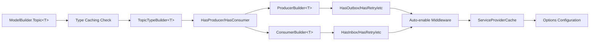
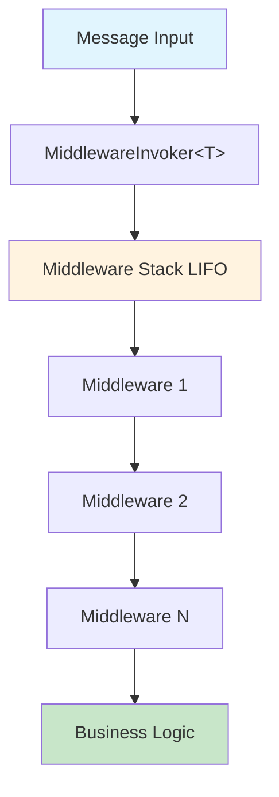
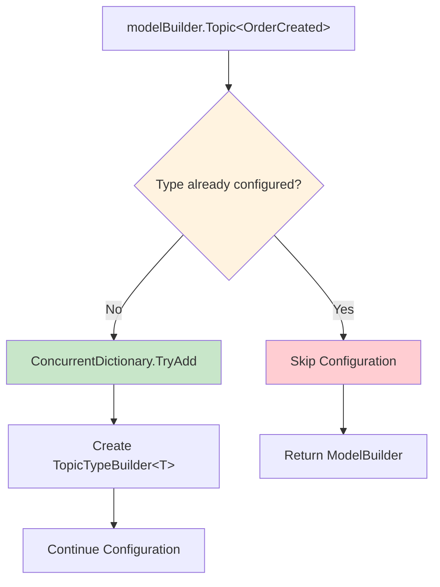
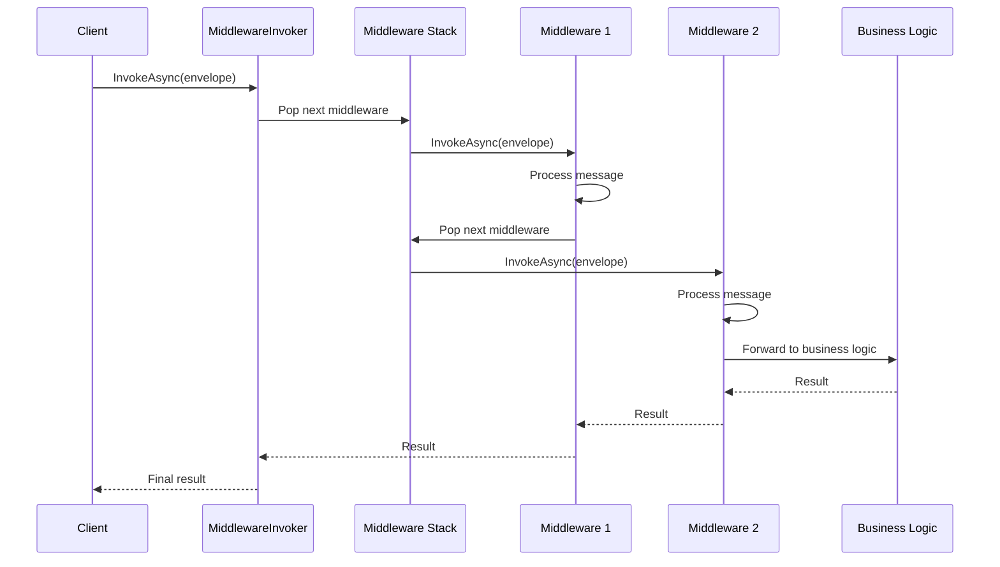
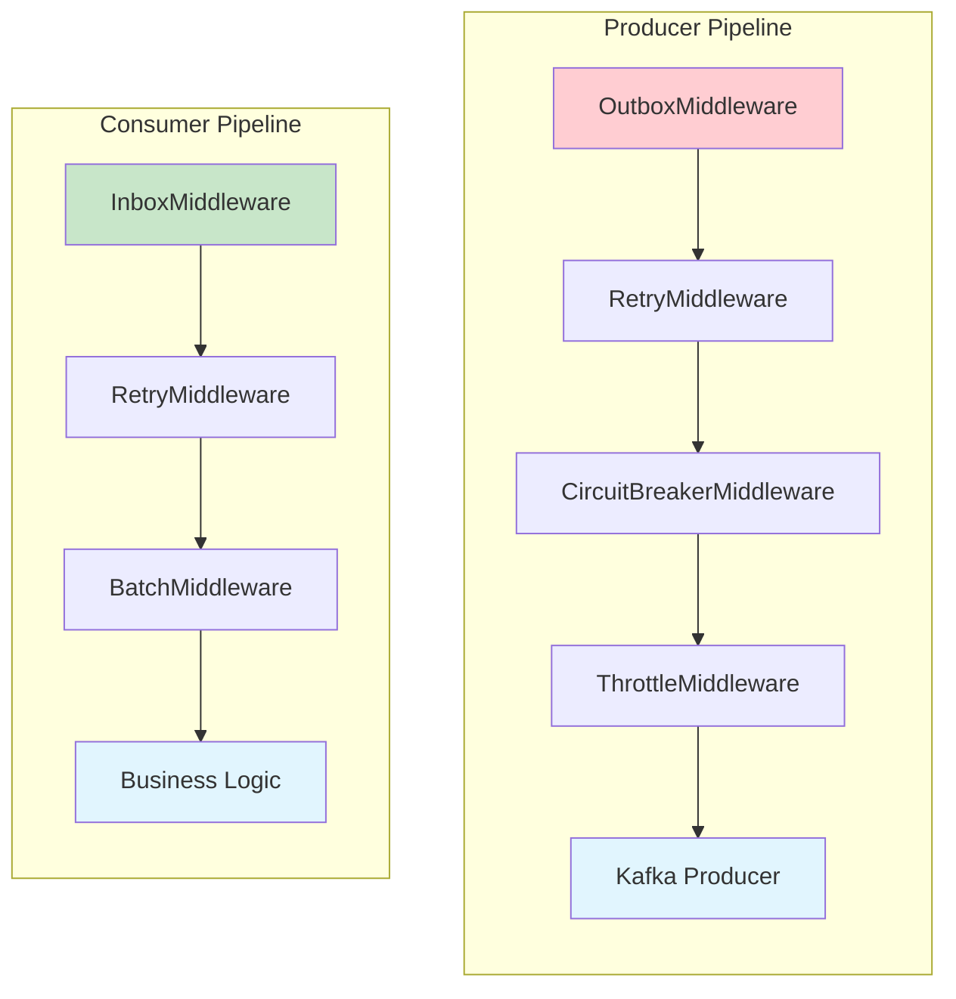
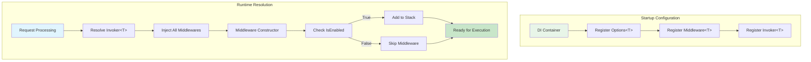
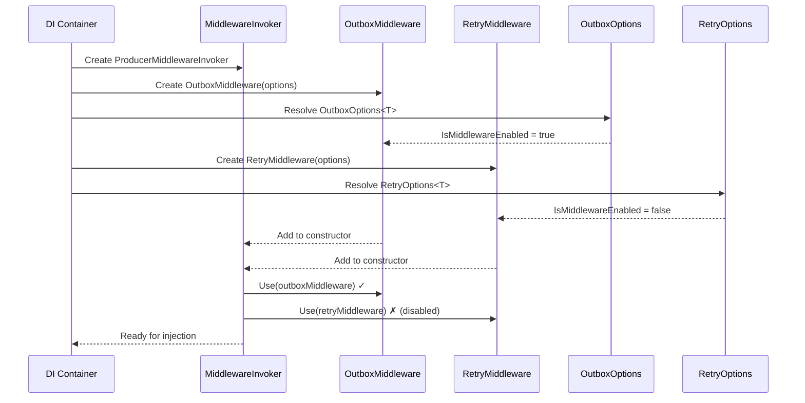
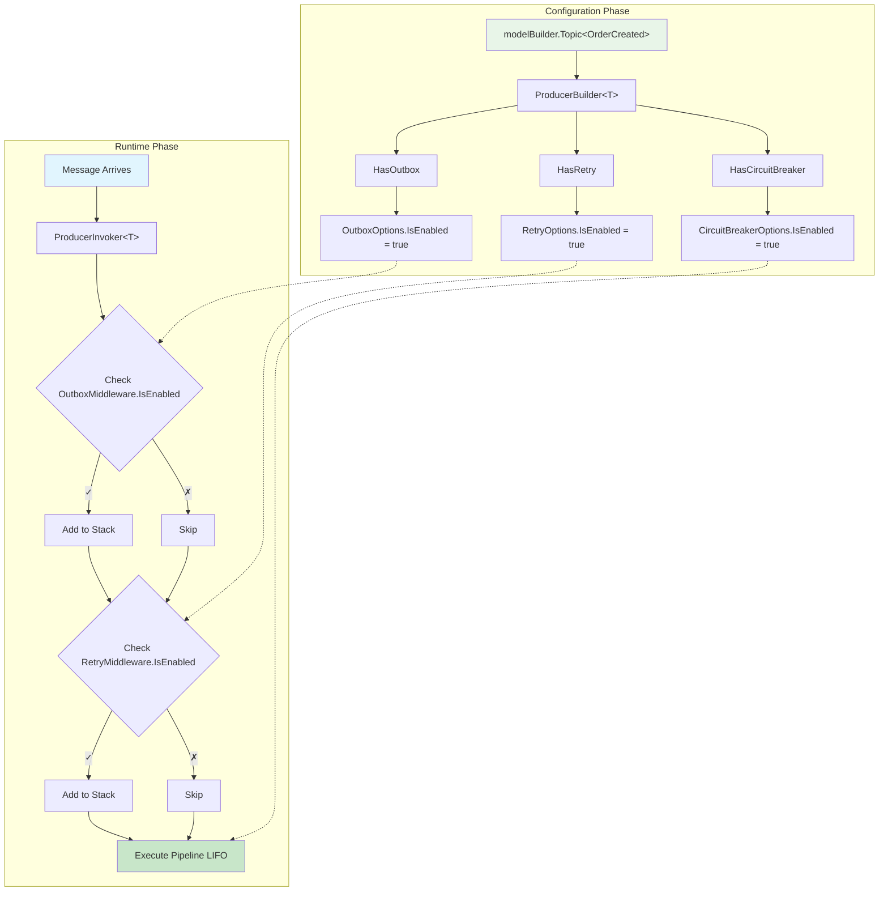

# Kafka Middleware Architecture

## Core Components

### Configuration Flow


### Execution Flow


## Component Interactions

### 1. Type Registration & Caching


```csharp
// ModelBuilderExtensions.cs
private static readonly ConcurrentDictionary<Type, bool> configuredTypes = new();

modelBuilder.Topic<OrderCreated>(topic => { ... });
```
- **Purpose**: Prevents duplicate topic configuration per type
- **Interaction**: `ConcurrentDictionary.TryAdd()` ensures single registration

### 2. Configuration Hierarchy
```csharp
// Base options with enablement control
public class MiddlewareOptions<T> { 
    public bool IsMiddlewareEnabled { get; set; } = false; 
}

// Specific options inherit behavior
public class OutboxMiddlewareOptions<T> : MiddlewareOptions<T> { ... }
```

### 3. Auto-Enablement Pattern
```csharp
// ProducerBuilder.HasOutbox()
public ProducerBuilder<T> HasOutbox(Action<OutboxBuilder<T>>? configure = null)
{
    var options = ServiceProviderCache.GetRequiredService<OutboxMiddlewareOptions<T>>();
    options.IsMiddlewareEnabled = true;  // ← Auto-enabled when configured
    configure?.Invoke(new OutboxBuilder<T>(options));
    return this;
}
```

### 4. Middleware Base Class
```csharp
internal abstract class Middleware<T>(MiddlewareOptions<T> options) : IMiddleware<T>
{
    public bool IsEnabled => options.IsMiddlewareEnabled;
    private readonly Stack<IMiddleware<T>> middlewareStack = new();
    
    protected void Use(IMiddleware<T> middleware)
    {
        if (middleware.IsEnabled) middlewareStack.Push(middleware);
    }
}
```
- **Key Interaction**: `IsEnabled` controls pipeline inclusion
- **Stack Pattern**: LIFO execution order

### 5. Pipeline Construction
```csharp
// ConsumerMiddlewareInvoker.cs
public ConsumerMiddlewareInvoker(
    InboxMiddleware<T> inbox,
    RetryMiddleware<T> retry,
    CircuitBreakerMiddleware<T> circuitBreaker,
    // ... other middlewares
)
{
    Use(inbox);           // Only added if inbox.IsEnabled == true
    Use(retry);           // Only added if retry.IsEnabled == true
    Use(circuitBreaker);  // Only added if circuitBreaker.IsEnabled == true
}
```

## Execution Pipeline

### Message Processing Flow


### Pipeline Construction


### Middleware Enablement Flow


## Key Design Principles

### Type Safety
- Generic `<T>` ensures compile-time message type validation
- Builder pattern prevents invalid configurations

### Automatic Configuration
- `HasXXX()` methods automatically set `IsMiddlewareEnabled = true`
- No manual enablement required

### Dependency Injection
- Options resolved via `ServiceProviderCache`
- Middleware instances injected with configured options
- Invokers receive all middleware dependencies

### Thread Safety
- `ConcurrentDictionary` for type registration
- Immutable configuration after startup

## Runtime Pipeline Construction

### Dependency Injection Flow


### Invoker Construction Process


## Configuration Example

```csharp
modelBuilder.Topic<OrderCreated>(topic =>
    topic.HasProducer(producer =>
        producer.HasOutbox(outbox => outbox.WithStrategy(OutboxPublishingStrategy.ImmediateWithFallback))
                .HasRetry(retry => retry.WithMaxAttempts(3))
                .HasCircuitBreaker(cb => cb.WithFailureThreshold(5))
    )
);
```

**What happens:**
1. `Topic<OrderCreated>` cached in `ConcurrentDictionary`
2. `ProducerBuilder<OrderCreated>` created
3. Each `HasXXX()` call:
   - Retrieves options from DI
   - Sets `IsMiddlewareEnabled = true`
   - Applies user configuration
4. At runtime: Only enabled middlewares added to execution stack

### Complete Configuration to Execution Flow


## Adding New Middleware

### Step-by-Step Guide

Follow this pattern to add a new middleware (using `CompressionMiddleware` as example):

#### 1. Create Options Class
```csharp
// MiddlewareOptions/CompressionMiddlewareOptions.cs
public class CompressionMiddlewareOptions<T> : MiddlewareOptions<T>
    where T : class
{
    /// <summary>
    /// Compression algorithm to use. Default is Gzip.
    /// </summary>
    public CompressionAlgorithm Algorithm { get; set; } = CompressionAlgorithm.Gzip;
    
    /// <summary>
    /// Compression level. Default is Optimal.
    /// </summary>
    public CompressionLevel Level { get; set; } = CompressionLevel.Optimal;
    
    /// <summary>
    /// Minimum message size to compress (bytes). Default is 1024.
    /// </summary>
    public int MinSizeBytes { get; set; } = 1024;
}
```

#### 2. Create Middleware Implementation
```csharp
// Middlewares/CompressionMiddleware.cs
[ScopedService]
internal class CompressionMiddleware<T>(CompressionMiddlewareOptions<T> options) : Middleware<T>(options)
    where T : class
{
    public override async ValueTask InvokeAsync(IEnvelope<T> envelope, CancellationToken cancellationToken = default)
    {
        // Compress message if size exceeds threshold
        if (ShouldCompress(message))
        {
            message = CompressMessage(message);
        }
        
        // Continue pipeline
        await base.InvokeAsync(message, cancellationToken);
    }
    
    private bool ShouldCompress(IEnvelope<T> envelope) => 
        GetMessageSize(message) > options.MinSizeBytes;
}
```

#### 3. Create Configuration Builder
```csharp
// Extensions/MiddlewareBuilders/CompressionBuilder.cs
public class CompressionBuilder<T>(CompressionMiddlewareOptions<T> options)
    where T : class
{
    public CompressionBuilder<T> WithAlgorithm(CompressionAlgorithm algorithm)
    {
        options.Algorithm = algorithm;
        return this;
    }
    
    public CompressionBuilder<T> WithLevel(CompressionLevel level)
    {
        options.Level = level;
        return this;
    }
    
    public CompressionBuilder<T> WithMinSize(int sizeBytes)
    {
        options.MinSizeBytes = sizeBytes;
        return this;
    }
}
```

#### 4. Add HasXXX Method to Builder
```csharp
// Extensions/ModelBuilderExtensions.cs - ProducerBuilder<T> class
public ProducerBuilder<T> HasCompression(Action<CompressionBuilder<T>>? configure = null)
{
    var options = ServiceProviderCache.Instance
        .GetOrAdd(KafkaOptionsExtension.CachedOptions!, true)
        .GetRequiredService<CompressionMiddlewareOptions<T>>();

    // Auto-enable middleware
    options.IsMiddlewareEnabled = true;

    var builder = new CompressionBuilder<T>(options);
    configure?.Invoke(builder);
    return this;
}
```

#### 5. Update Middleware Invoker
```csharp
// Middlewares/ProducerMiddlewareInvoker.cs
public ProducerMiddlewareInvoker(
    OutboxMiddleware<T> outboxMiddleware,
    RetryMiddleware<T> retryMiddleware,
    CircuitBreakerMiddleware<T> circuitBreakerMiddleware,
    ThrottleMiddleware<T> throttleMiddleware,
    BatchMiddleware<T> batchMiddleware,
    AwaitForgetMiddleware<T> awaitForgetMiddleware,
    FireForgetMiddleware<T> fireForgetMiddleware,
    CompressionMiddleware<T> compressionMiddleware  // ← Add new middleware
)
{
    Use(outboxMiddleware);
    Use(retryMiddleware);
    Use(circuitBreakerMiddleware);
    Use(throttleMiddleware);
    Use(batchMiddleware);
    Use(awaitForgetMiddleware);
    Use(fireForgetMiddleware);
    Use(compressionMiddleware);  // ← Add to pipeline
}
```

#### 6. Register in DI Container
```csharp
// During startup configuration
services.AddScoped<CompressionMiddlewareOptions<T>>();
services.AddScoped<CompressionMiddleware<T>>();
```

### Usage Example
```csharp
modelBuilder.Topic<OrderCreated>(topic =>
    topic.HasProducer(producer =>
        producer.HasCompression(compression =>
            compression.WithAlgorithm(CompressionAlgorithm.Gzip)
                      .WithLevel(CompressionLevel.Optimal)
                      .WithMinSize(2048)
        )
    )
);
```

### Key Points
- **Inheritance**: Always inherit from `MiddlewareOptions<T>` and `Middleware<T>`
- **Auto-enablement**: Set `IsMiddlewareEnabled = true` in `HasXXX()` method
- **Pipeline order**: Position in invoker constructor determines execution order
- **Type safety**: Generic `<T>` ensures compile-time message type validation
- **DI registration**: Both options and middleware must be registered in container

```csharp
producer.HasOutbox(outbox => {
    outbox.WithPollingInterval(TimeSpan.FromSeconds(10));
    outbox.WithStrategy(OutboxPublishingStrategy.BackgroundOnly);
});
```

**What happens:**
1. `ProducerBuilder<T>.HasOutbox()` is called
2. `ServiceProviderCache` retrieves or creates `OutboxMiddlewareOptions<T>` instance
3. **Automatic enablement**: `options.IsMiddlewareEnabled = true` is set immediately
4. Specific builder (`OutboxBuilder<T>`) is created with the options instance
5. User configuration lambda is applied to the builder
6. Options are updated with user-specified values

### Step 4: Dependency Injection Registration

**During application startup (DI container configuration):**
1. All middleware option classes are registered as singleton services
2. All middleware implementations are registered as scoped services
3. Middleware invokers are registered with all required middleware dependencies

### Step 5: Runtime Middleware Pipeline Construction

**When a message processing request is made:**

#### For Producers (ProducerMiddlewareInvoker):
```csharp
public ProducerMiddlewareInvoker(
    OutboxMiddleware<T> outboxMiddleware,
    RetryMiddleware<T> retryMiddleware,
    CircuitBreakerMiddleware<T> circuitBreakerMiddleware,
    // ... other middlewares
)
{
    Use(outboxMiddleware);        // Checks IsEnabled internally
    Use(retryMiddleware);         // Checks IsEnabled internally
    Use(circuitBreakerMiddleware); // Checks IsEnabled internally
    // ... continues for all middlewares
}
```

#### For Consumers (ConsumerMiddlewareInvoker):
```csharp
public ConsumerMiddlewareInvoker(
    InboxMiddleware<T> inboxMiddleware,     // Consumer-specific
    RetryMiddleware<T> retryMiddleware,
    CircuitBreakerMiddleware<T> circuitBreakerMiddleware,
    // ... other middlewares
)
{
    Use(inboxMiddleware);         // Checks IsEnabled internally
    Use(retryMiddleware);         // Checks IsEnabled internally
    Use(circuitBreakerMiddleware); // Checks IsEnabled internally
    // ... continues for all middlewares
}
```

**What happens:**
1. DI container creates invoker instance with all middleware dependencies
2. Each middleware is instantiated with its specific options
3. `Middleware<T>` base constructor sets `IsEnabled` from options
4. `Use()` method checks `middleware.IsEnabled` before adding to pipeline
5. Only enabled middlewares are added to the execution stack

### Step 6: Message Processing Pipeline Execution

**When a message needs to be processed:**

```csharp
await middlewareInvoker.InvokeAsync(envelope, cancellationToken);
```

**Execution flow:**
1. `ProducerMiddlewareInvoker<T>` or `ConsumerMiddlewareInvoker<T>` receives the message
2. `InvokeAsync()` is called on the invoker
3. `Middleware<T>.InvokeAsync()` pops the next middleware from the stack
4. Each middleware in the stack processes the message in LIFO order
5. Each middleware can:
   - Process the message (outbox storage, retry logic, etc.)
   - Call the next middleware in the chain
   - Handle errors and implement patterns (circuit breaker, throttling)

### Step 7: Middleware-Specific Processing

#### Example: Outbox Middleware
1. **Immediate Strategy**: Attempts to publish immediately
2. **Fallback Strategy**: Stores in outbox table if immediate fails
3. **Background Strategy**: Always stores in outbox for background processing
4. **Polling**: Background service polls outbox table based on `PollingInterval`

#### Example: Retry Middleware
1. Catches exceptions from downstream middlewares
2. Implements exponential backoff based on `RetryMiddlewareOptions<T>`
3. Respects `MaxRetryAttempts` configuration
4. Re-throws exception after max attempts exceeded

## Configuration Examples

### Complete Producer Configuration
```csharp
modelBuilder.Topic<OrderCreated>(topic =>
{
    topic.HasProducer(producer =>
    {
        producer.HasOutbox(outbox =>
        {
            outbox.WithPollingInterval(TimeSpan.FromSeconds(5));
            outbox.WithStrategy(OutboxPublishingStrategy.ImmediateWithFallback);
            outbox.WithMaxImmediateRetryAttempts(3);
        });
        
        producer.HasRetry(retry =>
        {
            retry.WithMaxAttempts(5);
            retry.WithExponentialBackoff(TimeSpan.FromSeconds(1));
        });
        
        producer.HasCircuitBreaker(cb =>
        {
            cb.WithFailureThreshold(10);
            cb.WithRecoveryTime(TimeSpan.FromMinutes(1));
        });
        
        producer.HasThrottle(throttle =>
        {
            throttle.WithMaxConcurrentRequests(100);
            throttle.WithTimeWindow(TimeSpan.FromMinutes(1));
        });
    });
});
```

### Complete Consumer Configuration
```csharp
modelBuilder.Topic<OrderCreated>(topic =>
{
    topic.HasConsumer(consumer =>
    {
        consumer.HasInbox(inbox =>
        {
            inbox.WithDeduplicationWindow(TimeSpan.FromHours(24));
            inbox.WithProcessingTimeout(TimeSpan.FromMinutes(5));
        });
        
        consumer.HasRetry(retry =>
        {
            retry.WithMaxAttempts(3);
            retry.WithExponentialBackoff(TimeSpan.FromSeconds(2));
        });
        
        consumer.HasBatch(batch =>
        {
            batch.WithBatchSize(50);
            batch.WithMaxWaitTime(TimeSpan.FromSeconds(10));
        });
    });
});
```
