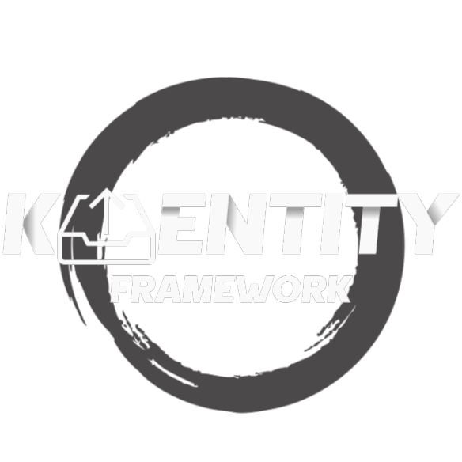

# K-Entity-Framework Documentation

<div align="center">
  
</div> 

[](https://github.com/cleberMargarida/k-entity-framework/actions/workflows/dotnet.yml)
[](https://codecov.io/gh/cleberMargarida/k-entity-framework)
[](https://www.nuget.org/packages/K.EntityFrameworkCore/)
[](https://www.nuget.org/packages/K.EntityFrameworkCore/)
[](https://opensource.org/licenses/MIT)
[](https://cleberMargarida.github.io/k-entity-framework/)
[](https://github.com/cleberMargarida/k-entity-framework/releases/latest)

**Tired of wrestling with complex Kafka setups that break Entity Framework's simplicity?**

K-Entity-Framework brings the simplicity you love about EF Core directly to Apache Kafka.

Imagine producing events as naturally as saving entities, with built-in transactional safety through the outbox pattern.

No more scattered configuration files or learning yet another messaging framework. *just the familiar DbContext semantics you already know.*

#### For installation guides, tutorials, examples, and API reference, visit our [DOCUMENTATION](https://cleberMargarida.github.io/k-entity-framework/)

## Quick Start

```csharp
builder.Services.AddDbContext<MyDbContext>(options => options

    // Configure EF Core to use SQL Server
    .UseSqlServer(builder.Configuration.GetConnectionString("SqlServer"))

    // Enable Kafka extensibility for EF Core (publishing/consuming integration)
    .UseKafkaExtensibility(builder.Configuration.GetConnectionString("Kafka")));

dbContext.Orders.Add(new Order { Id = 1232 });

// Not a block call, the event will be produced when SaveChangesAsync is called.
dbContext.OrderEvents.Produce(new OrderCreated { OrderId = 123 });

// Save and produce both.
await dbContext.SaveChangesAsync();

// here you're starting to consume kafka and moving the iterator cursor to the next offset in the assigned partitions.
await foreach (var order in dbContext.OrderEvents)
{
    await dbContext.SaveChangesAsync(); // Commit message
}
```

> 💡 **Want to see more examples?** Check out our [comprehensive documentation](https://cleberMargarida.github.io/k-entity-framework/) for advanced scenarios, configuration options, and best practices.

## Why K-Entity-Framework?

| Feature | K-Entity-Framework | Wolverine | MassTransit | KafkaFlow |
|---------|-------------------|-----------|-------------|-----------|
| **Focus** | Kafka-first with EF Core | Generic message broker | Generic message broker | Kafka-specific |
| **Outbox Pattern** | ✅ Built-in with EF transactions | ✅ Built-in with EF transactions | ❌ [Not supported for Kafka](https://github.com/MassTransit/MassTransit/discussions/3602) | ❌ Not suported |
| **Kafka Compatibility** | ✅ Full Kafka support | ⚠️ Generic abstraction limitations | ⚠️ Generic abstraction limitations | ✅ Full Kafka support |
| **Learning Curve** | ✅ Familiar EF semantics | ⚠️ New abstractions | ⚠️ New abstractions | ✅ Kafka-specific concepts |

## Contributing

Contributions are welcome! Please read our [contributing guidelines](CONTRIBUTING.md) for details.

## License

This project is licensed under the MIT License.
