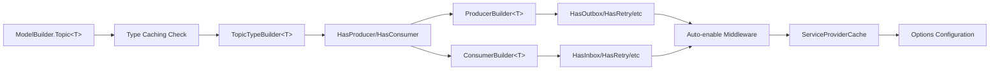
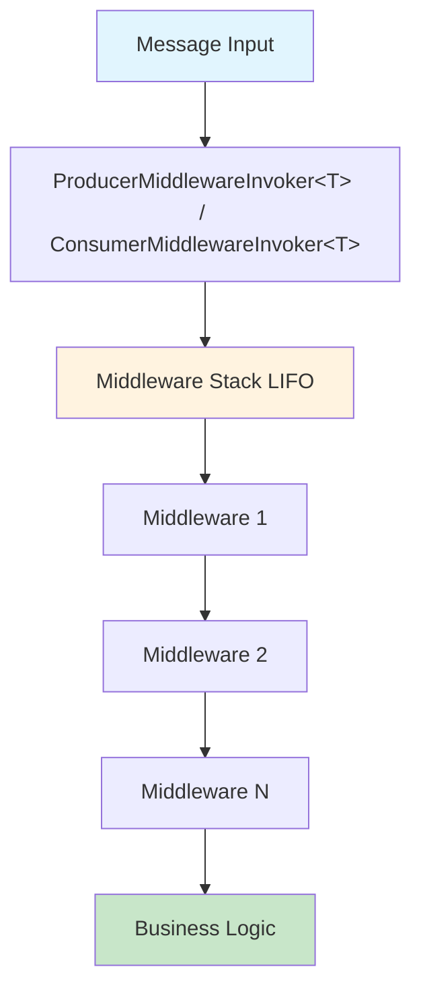
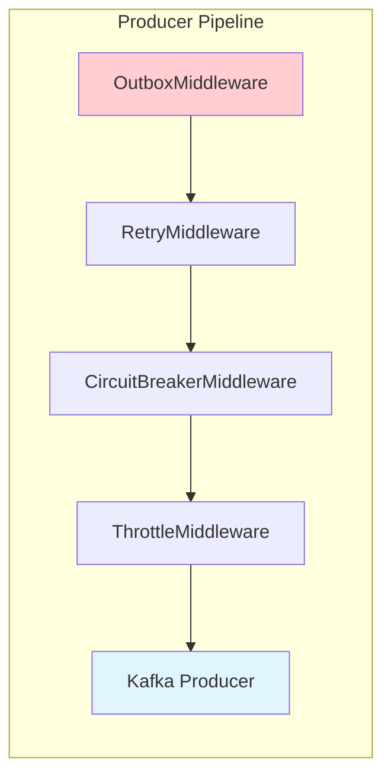
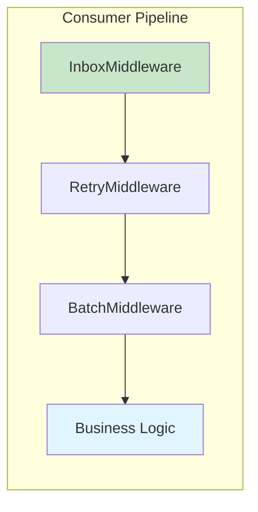
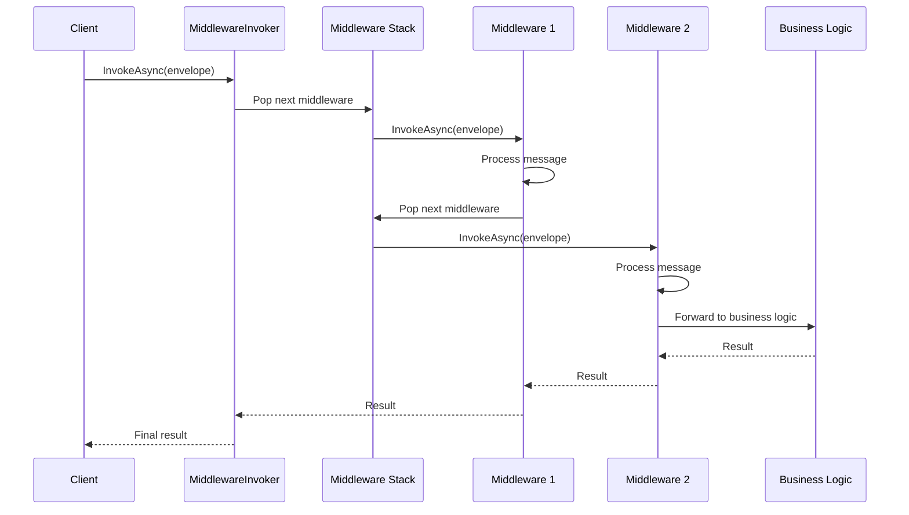

# Middleware Architecture

K-Entity-Framework uses a sophisticated middleware pipeline architecture that enables extensible and composable message processing. This document explains the core architectural patterns and design principles.

## Overview

The middleware system follows a pipeline pattern where messages flow through a series of configurable middleware components. Each middleware can:

- Transform messages
- Add cross-cutting concerns (logging, metrics, error handling)
- Control flow (circuit breaking, throttling, retries)
- Integrate with external systems (databases, caches)

## Core Components

### 1. Configuration Flow



### 2. Execution Flow



## Type Registration & Caching

The system uses type-based registration to ensure each message type gets its own middleware configuration:

```csharp
// Type registration flow
modelBuilder.Topic<OrderCreated>() --> {Type already configured?}
    No  --> ConcurrentDictionary.TryAdd --> Create TopicTypeBuilder<T>
    Yes --> Skip Configuration --> Return ModelBuilder
```

### Implementation Details

```csharp
public class TopicTypeBuilder<T> where T : class
{
    private static readonly ConcurrentDictionary<Type, bool> _configuredTypes = new();
    
    public TopicTypeBuilder<T> HasProducer(Action<ProducerBuilder<T>> configure = null)
    {
        if (_configuredTypes.TryAdd(typeof(T), true))
        {
            // First-time configuration
            var builder = new ProducerBuilder<T>();
            configure?.Invoke(builder);
            return this;
        }
        
        // Already configured - skip
        return this;
    }
}
```

## Middleware Pipeline Construction

### Producer Pipeline



### Consumer Pipeline



### Pipeline Construction Code

```csharp
public class ConsumerMiddlewareInvoker<T>
{
    private readonly Stack<IMiddleware<T>> _middlewares = new();
    
    public ConsumerMiddlewareInvoker(
        InboxMiddleware<T> inbox,
        RetryMiddleware<T> retry,
        CircuitBreakerMiddleware<T> circuitBreaker)
    {
        // Only add enabled middleware (LIFO order)
        if (circuitBreaker.IsEnabled) Use(circuitBreaker);
        if (retry.IsEnabled) Use(retry);
        if (inbox.IsEnabled) Use(inbox);
    }
    
    private void Use(IMiddleware<T> middleware)
    {
        _middlewares.Push(middleware);
    }
    
    public async Task<TResult> InvokeAsync<TResult>(
        Envelope<T> envelope, 
        Func<Envelope<T>, Task<TResult>> next)
    {
        var current = next;
        
        // Build pipeline in reverse order (LIFO)
        while (_middlewares.TryPop(out var middleware))
        {
            var capturedCurrent = current;
            current = env => middleware.InvokeAsync(env, capturedCurrent);
        }
        
        return await current(envelope);
    }
}
```

## Message Processing Flow

### Sequence Diagram



## Middleware Enablement

### Automatic Enablement Flow


### Implementation Example

```csharp
public class ProducerBuilder<T>
{
    public ProducerBuilder<T> HasOutbox(Action<OutboxBuilder<T>> configure = null)
    {
        // Automatically enable outbox middleware
        var options = ServiceProviderCache.GetService<OutboxMiddlewareSettings<T>>();
        options.IsMiddlewareEnabled = true;
        
        // Create builder and apply configuration
        var builder = new OutboxBuilder<T>(options);
        configure?.Invoke(builder);
        
        return this;
    }
    
    public ProducerBuilder<T> HasRetry(Action<RetryBuilder<T>> configure = null)
    {
        var options = ServiceProviderCache.GetService<RetryMiddlewareSettings<T>>();
        options.IsMiddlewareEnabled = true;
        
        var builder = new RetryBuilder<T>(options);
        configure?.Invoke(builder);
        
        return this;
    }
}
```

## Key Design Principles

### 1. Type Safety

- **Generic Constraints**: All middleware uses `<T> where T : class` for compile-time type validation
- **Builder Pattern**: Fluent configuration prevents invalid states
- **Expression Trees**: Type-safe property access via `Expression<Func<T, object>>`

```csharp
// Type-safe key configuration
topic.HasProducer(producer =>
{
    producer.WithKey(order => order.CustomerId); // Compile-time validated
});
```

### 2. Automatic Configuration

- **Convention over Configuration**: Calling `HasXXX()` methods automatically enables middleware
- **Zero Explicit Setup**: No manual registration of middleware required
- **Intelligent Defaults**: Sensible defaults for all configuration options

```csharp
// Middleware is automatically enabled and configured
topic.HasConsumer(consumer =>
{
    consumer.HasInbox();  // Automatically enables InboxMiddleware
    consumer.HasRetry();  // Automatically enables RetryMiddleware
});
```

### 3. Dependency Injection Integration

- **Service Provider Cache**: Efficient resolution of middleware settings
- **Scoped Lifetime**: Proper lifetime management for middleware components
- **Options Pattern**: Integration with .NET configuration system

```csharp
public class ServiceProviderCache
{
    private static readonly ConcurrentDictionary<Type, object> _cache = new();
    
    public static T GetService<T>() where T : class, new()
    {
        return (T)_cache.GetOrAdd(typeof(T), _ => new T());
    }
}
```

### 4. Thread Safety

- **Concurrent Collections**: Thread-safe type registration and caching
- **Immutable Configuration**: Options are immutable after startup
- **Lock-Free Design**: Minimal locking for high-performance operation

### 5. Extensibility

- **Plugin Architecture**: Easy to add new middleware types
- **Composable Design**: Middleware can be combined in any order
- **Custom Middleware**: Simple interface for custom implementations

```csharp
public interface IMiddleware<T>
{
    bool IsEnabled { get; }
    Task<TResult> InvokeAsync<TResult>(
        Envelope<T> envelope, 
        Func<Envelope<T>, Task<TResult>> next);
}
```

## Performance Considerations

### 1. Pipeline Construction

- **Build-Time Optimization**: Pipeline is constructed once at startup
- **LIFO Execution**: Stack-based execution for optimal performance
- **Minimal Allocations**: Reuse of delegate instances where possible

### 2. Type Caching

- **ConcurrentDictionary**: O(1) lookup performance for type registration
- **Generic Specialization**: JIT optimizations for each message type
- **Static Caching**: Type-level static fields for maximum performance

### 3. Middleware Lifecycle

- **Singleton Pattern**: Middleware instances are singletons where possible
- **Scoped Dependencies**: Database contexts and other resources are properly scoped
- **Lazy Initialization**: Middleware is only created when needed

## Error Handling

### 1. Configuration Errors

- **Validation at Build Time**: Invalid configurations throw exceptions during startup
- **Clear Error Messages**: Descriptive error messages with remediation steps
- **Fail Fast**: Configuration errors prevent application startup

### 2. Runtime Errors

- **Middleware Isolation**: Errors in one middleware don't affect others
- **Graceful Degradation**: Optional middleware can be skipped on errors
- **Error Propagation**: Errors bubble up through the pipeline appropriately

## Testing Strategies

### 1. Unit Testing

- **Middleware Isolation**: Each middleware can be tested independently
- **Mock Dependencies**: Easy to mock next delegate and dependencies
- **Type-Specific Tests**: Generic middleware can be tested with specific types

### 2. Integration Testing

- **Pipeline Testing**: Full pipeline can be tested end-to-end
- **Configuration Testing**: Verify correct middleware enablement and ordering
- **Performance Testing**: Measure pipeline overhead and throughput

## Next Steps

- [Plugin System](plugin-serialization.md) - Learn about the extensible plugin architecture
- [Service Attributes](service-attributes.md) - Understand service lifetime management
- [Middleware Configuration](../guides/kafka-configuration.md) - Configure specific middleware components
