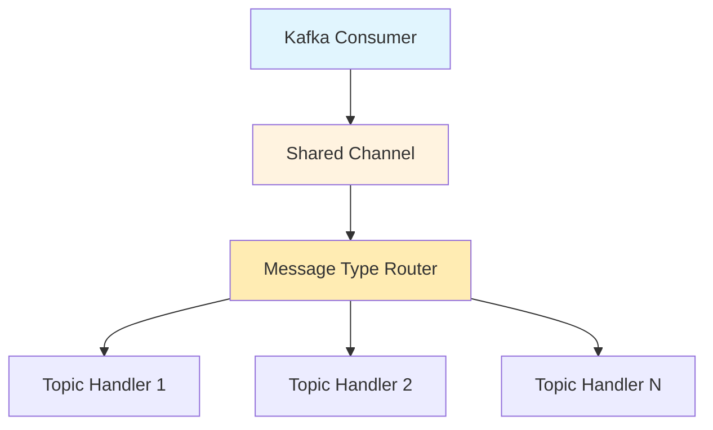
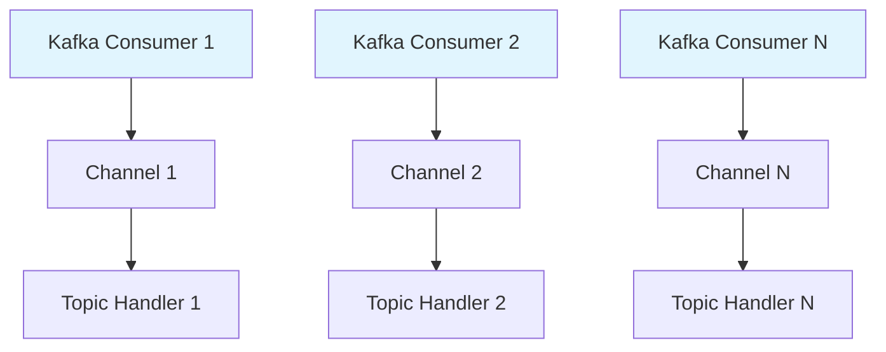

# Connection Management

K-Entity-Framework provides flexible connection management strategies to optimize Kafka consumer performance based on your application's specific needs. You can choose between shared connections for resource efficiency or dedicated connections for better isolation and control.

## Overview

Connection management strategies:

- **Shared Connection** - Multiple message types share a single Kafka consumer (default)
- **Exclusive Connection** - Each message type gets its own dedicated Kafka consumer
- **Per-Type Configuration** - Fine-grained control over consumer settings per message type

## Architecture

### Shared Connection (Default)



### Exclusive Connections



## Configuration

### Shared Connection (Default)

By default, all message types share a single Kafka consumer:

```csharp
modelBuilder.Topic<OrderCreated>(topic =>
{
    topic.HasName("order-events");
    // Uses shared connection by default
});

modelBuilder.Topic<PaymentProcessed>(topic =>
{
    topic.HasName("payment-events");  
    // Also uses shared connection
});
```

### Exclusive Connection

Configure a message type to use its own dedicated consumer:

```csharp
modelBuilder.Topic<CriticalAlert>(topic =>
{
    topic.HasName("critical-alerts");
    
    topic.HasConsumer(consumer =>
    {
        consumer.HasExclusiveConnection(connection =>
        {
            connection.GroupId = "critical-alerts-processor";
            connection.MaxPollIntervalMs = 300000;
            connection.SessionTimeoutMs = 30000;
            
            // Consumer-specific settings
            connection.EnableAutoCommit = false;
            connection.AutoOffsetReset = AutoOffsetReset.Earliest;
        });
    });
});
```

### Mixed Connection Strategies

You can mix both strategies in the same application:

```csharp
protected override void OnModelCreating(ModelBuilder modelBuilder)
{
    // High-priority messages get exclusive connections
    modelBuilder.Topic<CriticalAlert>(topic =>
    {
        topic.HasName("critical-alerts");
        topic.HasConsumer(consumer =>
        {
            consumer.HasExclusiveConnection(connection =>
            {
                connection.GroupId = "critical-alerts-exclusive";
                connection.MaxPollIntervalMs = 60000; // Shorter timeout
            });
        });
    });
    
    // Regular messages share a connection
    modelBuilder.Topic<OrderCreated>(topic =>
    {
        topic.HasName("order-events");
        // Uses shared connection (default)
    });
    
    modelBuilder.Topic<UserActivity>(topic =>
    {
        topic.HasName("user-activity");
        // Also uses shared connection
    });
}
```

## Consumer Configuration

### Exclusive Connection Settings

When using exclusive connections, you can configure all Kafka consumer properties:

```csharp
topic.HasConsumer(consumer =>
{
    consumer.HasExclusiveConnection(connection =>
    {
        // Consumer Group Settings
        connection.GroupId = "my-exclusive-group";
        connection.GroupInstanceId = "instance-1";
        
        // Session Management
        connection.SessionTimeoutMs = 30000;
        connection.HeartbeatIntervalMs = 3000;
        connection.MaxPollIntervalMs = 300000;
        
        // Offset Management
        connection.EnableAutoCommit = false;
        connection.AutoCommitIntervalMs = 5000;
        connection.AutoOffsetReset = AutoOffsetReset.Latest;
        
        // Performance Settings
        connection.MaxPollRecords = 500;
        connection.FetchMinBytes = 1;
        connection.FetchMaxWaitMs = 500;
        
        // Processing Settings  
        connection.MaxBufferedMessages = 2000;
        connection.BackpressureMode = ConsumerBackpressureMode.ApplyBackpressure;
    });
});
```

### Per-Type Buffer Configuration

Even with shared connections, you can configure different buffer sizes per message type:

```csharp
// High-volume events need larger buffers
modelBuilder.Topic<UserClick>(topic =>
{
    topic.HasName("user-clicks");
    topic.HasConsumer(consumer =>
    {
        consumer.HasMaxBufferedMessages(5000);
        consumer.HasBackpressureMode(ConsumerBackpressureMode.DropOldestMessage);
    });
});

// Critical events need conservative settings
modelBuilder.Topic<PaymentProcessed>(topic =>
{
    topic.HasName("payments");
    topic.HasConsumer(consumer =>
    {
        consumer.HasMaxBufferedMessages(100);
        consumer.HasBackpressureMode(ConsumerBackpressureMode.ApplyBackpressure);
    });
});
```

## Use Cases

### When to Use Shared Connections

**Advantages:**
- Lower resource usage (fewer TCP connections)
- Simpler deployment and monitoring
- Better for development and testing
- Good default choice for most applications

**Best for:**
- Applications with multiple low-to-medium volume topics
- Development and testing environments  
- Resource-constrained environments
- Applications where topics have similar SLA requirements

```csharp
// Example: E-commerce application with various events
modelBuilder.Topic<OrderCreated>(topic => topic.HasName("orders"));
modelBuilder.Topic<ProductViewed>(topic => topic.HasName("product-views"));
modelBuilder.Topic<CartUpdated>(topic => topic.HasName("cart-updates"));
modelBuilder.Topic<UserRegistered>(topic => topic.HasName("user-registrations"));
// All share a single consumer connection
```

### When to Use Exclusive Connections  

**Advantages:**
- Complete isolation between message types
- Independent failure domains
- Granular performance tuning
- Better for high-SLA requirements

**Best for:**
- Critical business events requiring isolation
- High-volume topics that need dedicated resources
- Topics with very different processing characteristics
- Applications requiring strict SLA guarantees

```csharp
// Example: Financial application with different SLA requirements
modelBuilder.Topic<TradingSignal>(topic =>
{
    topic.HasName("trading-signals");
    topic.HasConsumer(consumer =>
    {
        consumer.HasExclusiveConnection(connection =>
        {
            connection.GroupId = "trading-signals-ultra-low-latency";
            connection.MaxPollIntervalMs = 10000; // Very short timeout
            connection.MaxPollRecords = 10;       // Small batches for low latency
        });
    });
});

modelBuilder.Topic<RiskAlert>(topic =>
{
    topic.HasName("risk-alerts");
    topic.HasConsumer(consumer =>
    {
        consumer.HasExclusiveConnection(connection =>
        {
            connection.GroupId = "risk-alerts-high-priority";
            connection.MaxPollIntervalMs = 30000;
            connection.MaxPollRecords = 1;  // Process one at a time
        });
    });
});
```

## Performance Considerations

### Resource Usage

**Shared Connection:**
- 1 TCP connection to Kafka cluster
- 1 consumer thread
- Shared memory buffers
- Lower overall resource usage

**Exclusive Connections:**
- N TCP connections (one per topic)
- N consumer threads  
- Separate memory buffers per topic
- Higher resource usage but better isolation

### Scalability Patterns

```csharp
// Pattern 1: Hybrid approach for different tiers
public class ApplicationDbContext : DbContext
{
    protected override void OnModelCreating(ModelBuilder modelBuilder)
    {
        // Tier 1: Critical events (exclusive connections)
        ConfigureCriticalEvents(modelBuilder);
        
        // Tier 2: Business events (shared connection)
        ConfigureBusinessEvents(modelBuilder);
        
        // Tier 3: Analytics events (shared connection with larger buffers)
        ConfigureAnalyticsEvents(modelBuilder);
    }
    
    private void ConfigureCriticalEvents(ModelBuilder modelBuilder)
    {
        var criticalTopics = new[] { "payments", "trades", "alerts" };
        
        foreach (var topicName in criticalTopics)
        {
            // Each gets exclusive connection with tight SLA
        }
    }
}
```

## Monitoring and Observability

### Metrics to Track

**Per Connection:**
- Consumer lag per topic partition
- Processing rate and latency
- Connection health and stability
- Buffer utilization

**Overall:**
- Total connection count
- Resource usage (CPU, memory, network)
- Error rates across connections

### Manual Monitoring

```csharp
// Monitor consumer lag manually
public async Task<ConsumerLagInfo> GetConsumerLag(string groupId, string topic)
{
    // Use Kafka Admin API or monitoring tools like Kafka Manager
    // This is application-specific implementation
    return new ConsumerLagInfo 
    { 
        GroupId = groupId, 
        Topic = topic, 
        TotalLag = await GetTotalLagForGroup(groupId, topic) 
    };
}
```

### Standard Logging

```csharp
// Use standard .NET logging for Kafka operations
builder.Services.AddLogging(logging =>
{
    logging.AddConsole();
    logging.SetMinimumLevel(LogLevel.Information);
    
    // Kafka client logging is handled internally
    // Set log level to see Kafka client events
});
```

## Best Practices

1. **Start with Shared Connections** - Use as default, optimize later if needed
2. **Use Exclusive for Critical Paths** - When isolation and SLA are important
3. **Monitor Resource Usage** - Track connection count and resource consumption
4. **Configure Appropriate Timeouts** - Based on processing requirements
5. **Test Failure Scenarios** - Verify behavior when connections fail
6. **Plan for Scaling** - Consider connection limits in Kafka cluster
7. **Use Meaningful Group IDs** - For monitoring and operational clarity
8. **Configure Dead Letter Handling** - For both connection types

## Troubleshooting

### Common Issues

**Shared Connection Problems:**
- One slow message type blocking others
- Resource contention between topics
- Difficult to isolate performance issues

**Solutions:**
```csharp
// Move problematic topics to exclusive connections
modelBuilder.Topic<SlowProcessingEvent>(topic =>
{
    topic.HasConsumer(consumer =>
    {
        consumer.HasExclusiveConnection(connection =>
        {
            connection.GroupId = "slow-processing-isolated";
        });
    });
});
```

**Exclusive Connection Problems:**
- Too many connections to Kafka
- Resource exhaustion
- Complex monitoring

**Solutions:**
```csharp
// Consolidate related topics
modelBuilder.Topic<OrderEvent>(topic =>
{
    topic.HasConsumer(consumer =>
    {
        consumer.HasExclusiveConnection(connection =>
        {
            connection.GroupId = "order-processing-combined";
            // Handle multiple order-related message types
        });
    });
});
```

### Performance Debugging

Monitor connection performance through standard Kafka metrics and application logs. Use Kafka management tools and standard .NET monitoring approaches for performance analysis.
