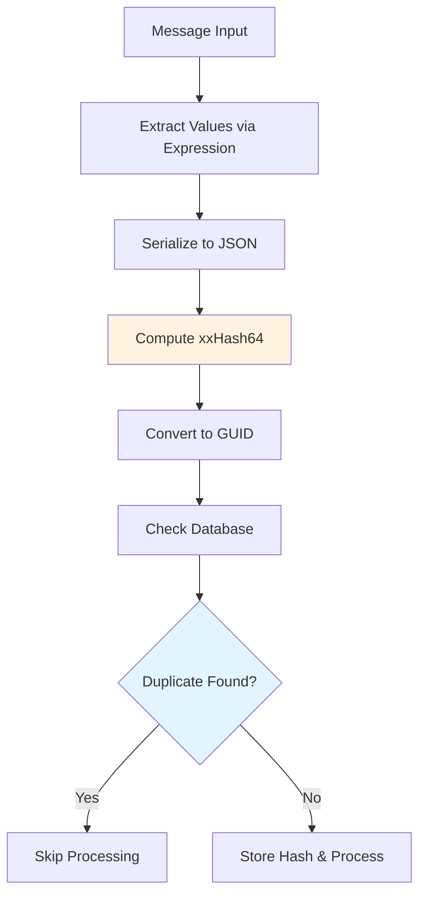

# Message Deduplication

K-Entity-Framework provides a sophisticated message deduplication system that prevents duplicate message processing using expression trees and the high-performance xxHash64 algorithm. This feature is essential for ensuring message idempotency in distributed systems.

## Overview

The deduplication feature prevents duplicate message processing by:

- Computing fast hashes of message content using xxHash64
- Storing hash values for a configurable time window
- Using expression trees for type-safe value extraction
- Leveraging GUID storage for efficient database lookups

## Architecture

### Core Components

1. **Expression Tree Compilation** - Uses `Expression<Func<T, object>>` for type-safe value extraction
2. **xxHash64 Algorithm** - Extremely fast non-cryptographic hash function
3. **GUID Storage** - 64-bit xxHash64 results converted to GUIDs for database storage
4. **Time Window Management** - Configurable retention period for deduplication records

### Hash Computation Flow



## Configuration

### Basic Deduplication

Configure deduplication using a simple property:

```csharp
modelBuilder.Topic<OrderCreated>(topic =>
{
    topic.HasConsumer(consumer =>
    {
        consumer.HasInbox(inbox =>
        {
            inbox.HasDeduplicateProperties(order => order.OrderId);
        });
    });
});
```

### Composite Key Deduplication

Use multiple properties for more sophisticated deduplication:

```csharp
modelBuilder.Topic<PaymentProcessed>(topic =>
{
    topic.HasConsumer(consumer =>
    {
        consumer.HasInbox(inbox =>
        {
            inbox.HasDeduplicateProperties(payment => new { 
                payment.OrderId, 
                payment.Amount,
                payment.PaymentMethod 
            });
        });
    });
});
```

### Calculated Value Deduplication

Perform calculations within the deduplication expression:

```csharp
modelBuilder.Topic<UserActivity>(topic =>
{
    topic.HasConsumer(consumer =>
    {
        consumer.HasInbox(inbox =>
        {
            inbox.HasDeduplicateProperties(activity => new { 
                activity.UserId,
                activity.ActivityType,
                DateOnly = activity.Timestamp.Date  // Only date, ignore time
            });
        });
    });
});
```

### Time Window Configuration

Control how long deduplication records are retained:

```csharp
modelBuilder.Topic<OrderCreated>(topic =>
{
    topic.HasConsumer(consumer =>
    {
        consumer.HasInbox(inbox =>
        {
            inbox.HasDeduplicateProperties(order => order.OrderId);
            inbox.UseDeduplicationTimeWindow(TimeSpan.FromHours(24));
        });
    });
});
```

## Implementation Details

### Expression Tree Compilation

The system compiles expressions at startup for maximum runtime performance:

```csharp
public class InboxMiddlewareSettings<T> : MiddlewareSettings<T>
{
    private Func<T, object>? _deduplicationValueAccessor;
    
    public Expression<Func<T, object>>? DeduplicationValueAccessor 
    { 
        set => _deduplicationValueAccessor = CompileExpression(value);
    }
    
    private static Func<T, object> CompileExpression(Expression<Func<T, object>> expression)
    {
        if (expression == null) return null;
        
        // Use the existing ParameterReplacer utility for expression transformation
        var optimizedExpression = ParameterReplacer.ReplaceParameter(expression);
        return optimizedExpression.Compile();
    }
}
```

### Hash Generation

The hashing process uses xxHash64 for optimal performance:

```csharp
internal Guid Hash(Envelope<T> envelope)
{
    if (_deduplicationValueAccessor == null)
        return Guid.Empty;
        
    // Extract values using compiled accessor
    var values = _deduplicationValueAccessor(envelope.Message);
    
    // Serialize to JSON for consistent representation
    var json = JsonSerializer.Serialize(values, JsonSerializerOptions.Default);
    var bytes = Encoding.UTF8.GetBytes(json);
    
    // Compute xxHash64
    var hash = XxHash64.ComputeHash(bytes);
    
    // Convert to GUID (first 8 bytes = hash, remaining bytes = zeros)
    var guidBytes = new byte[16];
    BitConverter.GetBytes(hash).CopyTo(guidBytes, 0);
    
    return new Guid(guidBytes);
}
```

### Database Storage

Deduplication records are stored in the InboxMessage table:

```csharp
public class InboxMessage
{
    public Guid Id { get; set; }              // Primary key
    public Guid DeduplicationHash { get; set; } // xxHash64 as GUID
    public DateTime ProcessedAt { get; set; }    // For cleanup
    public string MessageType { get; set; }     // Message type
    public byte[] MessageData { get; set; }     // Serialized message
}
```

## Performance Characteristics

### Hash Computation Performance

| Component | Performance | Notes |
|-----------|-------------|-------|
| xxHash64 | ~15-20 GB/s | Extremely fast on modern CPUs |
| JSON Serialization | ~100-500 MB/s | Depends on object complexity |
| Expression Execution | ~1-2 ns | Compiled, no reflection |

### Expression Compilation

- **Startup Cost**: Expression compilation happens once at application startup
- **Runtime Performance**: Equivalent to hand-written property access
- **No Reflection**: Zero reflection overhead during message processing

### Database Operations

- **Lookup Performance**: O(1) primary key lookup on GUID
- **Index Efficiency**: Clustered index on DeduplicationHash for fast duplicate detection
- **Cleanup Operations**: Periodic cleanup based on `DeduplicationTimeWindow`

## Usage Patterns

### E-commerce Order Processing

```csharp
// Prevent duplicate order processing
modelBuilder.Topic<OrderCreated>(topic =>
{
    topic.HasConsumer(consumer =>
    {
        consumer.HasInbox(inbox =>
        {
            inbox.DeduplicateBy(order => order.OrderId)
                 .UseDeduplicationTimeWindow(TimeSpan.FromDays(1));
        });
    });
});

// Prevent duplicate payment processing
modelBuilder.Topic<PaymentProcessed>(topic =>
{
    topic.HasConsumer(consumer =>
    {
        consumer.HasInbox(inbox =>
        {
            inbox.DeduplicateBy(payment => new { 
                payment.OrderId,
                payment.PaymentId,
                payment.Amount
            }).UseDeduplicationTimeWindow(TimeSpan.FromHours(6));
        });
    });
});
```

### User Activity Tracking

```csharp
// Deduplicate user login events by user and date
modelBuilder.Topic<UserLogin>(topic =>
{
    topic.HasConsumer(consumer =>
    {
        consumer.HasInbox(inbox =>
        {
            inbox.DeduplicateBy(login => new { 
                login.UserId,
                Date = login.LoginTime.Date
            }).UseDeduplicationTimeWindow(TimeSpan.FromDays(7));
        });
    });
});

// Deduplicate page view events by user, page, and hour
modelBuilder.Topic<PageView>(topic =>
{
    topic.HasConsumer(consumer =>
    {
        consumer.HasInbox(inbox =>
        {
            inbox.DeduplicateBy(view => new { 
                view.UserId,
                view.PageUrl,
                Hour = new DateTime(view.Timestamp.Year, view.Timestamp.Month, 
                                  view.Timestamp.Day, view.Timestamp.Hour, 0, 0)
            });
        });
    });
});
```

### Financial Transactions

```csharp
// Prevent duplicate transaction processing
modelBuilder.Topic<TransactionCreated>(topic =>
{
    topic.HasConsumer(consumer =>
    {
        consumer.HasInbox(inbox =>
        {
            inbox.DeduplicateBy(transaction => new { 
                transaction.TransactionId,
                transaction.AccountId,
                transaction.Amount,
                transaction.Currency
            }).UseDeduplicationTimeWindow(TimeSpan.FromDays(30));
        });
    });
});
```

### IoT Sensor Data

```csharp
// Deduplicate sensor readings by device and time window
modelBuilder.Topic<SensorReading>(topic =>
{
    topic.HasConsumer(consumer =>
    {
        consumer.HasInbox(inbox =>
        {
            inbox.DeduplicateBy(reading => new { 
                reading.DeviceId,
                reading.SensorType,
                // Round to nearest 5 minutes
                TimeWindow = new DateTime(reading.Timestamp.Ticks - 
                    (reading.Timestamp.Ticks % TimeSpan.FromMinutes(5).Ticks))
            }).UseDeduplicationTimeWindow(TimeSpan.FromHours(1));
        });
    });
});
```

## Advanced Configuration

### Custom Time Windows

Different message types can have different retention periods:

```csharp
// Critical financial data - longer retention
modelBuilder.Topic<PaymentProcessed>(topic =>
{
    topic.HasConsumer(consumer =>
    {
        consumer.HasInbox(inbox =>
        {
            inbox.DeduplicateBy(payment => payment.PaymentId)
                 .UseDeduplicationTimeWindow(TimeSpan.FromDays(90));
        });
    });
});

// High-volume telemetry - shorter retention
modelBuilder.Topic<TelemetryEvent>(topic =>
{
    topic.HasConsumer(consumer =>
    {
        consumer.HasInbox(inbox =>
        {
            inbox.DeduplicateBy(telemetry => new { 
                telemetry.DeviceId, 
                telemetry.MetricName 
            }).UseDeduplicationTimeWindow(TimeSpan.FromMinutes(30));
        });
    });
});
```

### Conditional Deduplication

Use complex expressions for conditional deduplication logic:

```csharp
modelBuilder.Topic<OrderUpdated>(topic =>
{
    topic.HasConsumer(consumer =>
    {
        consumer.HasInbox(inbox =>
        {
            inbox.DeduplicateBy(order => new { 
                order.OrderId,
                // Only deduplicate status changes, not other updates
                IsStatusChange = order.UpdateType == "StatusChange",
                StatusValue = order.UpdateType == "StatusChange" ? order.NewStatus : null
            });
        });
    });
});
```

## Maintenance and Cleanup

### Automatic Cleanup

The system automatically removes expired deduplication records:

```csharp
public class DeduplicationCleanupService : BackgroundService
{
    protected override async Task ExecuteAsync(CancellationToken stoppingToken)
    {
        while (!stoppingToken.IsCancellationRequested)
        {
            await CleanupExpiredRecords();
            await Task.Delay(TimeSpan.FromHours(1), stoppingToken);
        }
    }
    
    private async Task CleanupExpiredRecords()
    {
        var cutoffTime = DateTime.UtcNow.AddDays(-7); // Default cleanup window
        
        await _dbContext.InboxMessages
            .Where(m => m.ProcessedAt < cutoffTime)
            .ExecuteDeleteAsync();
    }
}
```

### Manual Cleanup

For specific scenarios, you can manually clean up deduplication records:

```csharp
public async Task CleanupOrderDeduplication(string orderId)
{
    await _dbContext.InboxMessages
        .Where(m => m.MessageType == typeof(OrderCreated).Name)
        .Where(m => m.MessageData.Contains(orderId)) // Simple contains check
        .ExecuteDeleteAsync();
}
```

## Monitoring and Diagnostics

### Deduplication Metrics

Track deduplication effectiveness:

```csharp
public class DeduplicationMetrics
{
    private readonly IMetricsCollector _metrics;
    
    public void RecordDuplicateDetected(string messageType)
    {
        _metrics.Counter("deduplication.duplicates_detected")
               .WithTag("message_type", messageType)
               .Increment();
    }
    
    public void RecordHashComputationTime(string messageType, TimeSpan duration)
    {
        _metrics.Timer("deduplication.hash_computation_time")
               .WithTag("message_type", messageType)
               .Record(duration);
    }
}
```

### Logging

Enable detailed logging for deduplication operations:

```csharp
public class InboxMiddleware<T> : IMiddleware<T>
{
    public async Task<TResult> InvokeAsync<TResult>(
        Envelope<T> envelope, 
        Func<Envelope<T>, Task<TResult>> next)
    {
        var hash = _settings.Hash(envelope);
        
        if (await IsDuplicate(hash))
        {
            _logger.LogInformation("Duplicate message detected for {MessageType} with hash {Hash}",
                typeof(T).Name, hash);
            return default(TResult);
        }
        
        _logger.LogDebug("Processing new message for {MessageType} with hash {Hash}",
            typeof(T).Name, hash);
            
        return await next(envelope);
    }
}
```

## Error Handling

### Expression Compilation Errors

Handle errors during expression compilation:

```csharp
try
{
    inbox.DeduplicateBy(order => order.InvalidProperty);
}
catch (ArgumentException ex)
{
    _logger.LogError(ex, "Invalid deduplication expression for {MessageType}", typeof(T).Name);
    throw new ConfigurationException($"Deduplication expression compilation failed: {ex.Message}");
}
```

### Hash Computation Errors

Handle runtime errors during hash computation:

```csharp
internal Guid Hash(Envelope<T> envelope)
{
    try
    {
        var values = _deduplicationValueAccessor(envelope.Message);
        var json = JsonSerializer.Serialize(values);
        return ComputeHash(json);
    }
    catch (Exception ex)
    {
        _logger.LogError(ex, "Failed to compute deduplication hash for {MessageType}", typeof(T).Name);
        return Guid.Empty; // Fall back to no deduplication
    }
}
```

## Best Practices

### 1. Choose Appropriate Deduplication Keys

- **Use stable identifiers** that don't change across message versions
- **Include business-relevant fields** that define uniqueness
- **Avoid timestamps** unless you want time-based deduplication
- **Consider composite keys** for complex deduplication scenarios

### 2. Set Appropriate Time Windows

- **Balance storage vs. protection** - longer windows use more storage
- **Consider business requirements** - how long should deduplication last?
- **Account for retry policies** - ensure window covers retry periods
- **Monitor storage usage** and adjust as needed

### 3. Performance Optimization

- **Keep expressions simple** - complex calculations slow down processing
- **Use primitive types** when possible in deduplication keys
- **Monitor hash computation time** and optimize expressions if needed
- **Consider message volume** when setting cleanup intervals

### 4. Testing

- **Test duplicate scenarios** explicitly in your integration tests
- **Verify time window behavior** with messages across different time periods
- **Test expression edge cases** like null values and missing properties
- **Monitor deduplication effectiveness** in production

## Next Steps

- [Inbox Pattern](inbox.md) - Learn more about the inbox pattern implementation
- [Performance Tuning](../guides/performance-tuning.md) - Optimize deduplication performance
- [Examples](../examples/deduplication-examples.md) - See more deduplication examples
