# Exclusive Node Coordination

K-Entity-Framework supports clustered outbox processing with **exclusive-node coordination**. In this mode, multiple application instances share the same outbox table, but **only one instance (the leader) processes rows at any given time**. The remaining instances stay idle and are ready to take over instantly if the leader goes down.

## Overview

| Aspect | Detail |
|---|---|
| **Strategy** | `UseExclusiveNode()` on the outbox worker builder |
| **Leader election** | Kafka consumer group on a single-partition coordination topic |
| **Failover** | Automatic — a new leader is elected within the session timeout |
| **Configuration** | [`ExclusiveNodeOptions`](../api/K.EntityFrameworkCore.Extensions.ExclusiveNodeOptions.yml) |

## How It Works

### Kafka Consumer Group Mechanism

Exclusive-node coordination leverages the Kafka consumer group protocol to elect a leader:

1. **Coordination Topic** — A dedicated Kafka topic (default: `__k_outbox_exclusive`) is auto-created with **exactly one partition**.
2. **Consumer Group** — Every worker node joins the same consumer group (default: `k-outbox-exclusive`).
3. **Single Partition Assignment** — Because there is only one partition, Kafka assigns it to exactly one consumer in the group. That consumer becomes the **leader**.
4. **Heartbeat & Session** — The leader sends periodic heartbeats. If it stops (crash, deployment, etc.), the group coordinator detects the failure and reassigns the partition to another node.

```mermaid
graph LR
    subgraph Kafka
        T["Coordination Topic<br/>(1 partition)"]
    end

    subgraph Cluster
        N1["Node A<br/>✅ Leader"]
        N2["Node B<br/>🟡 Standby"]
        N3["Node C<br/>🟡 Standby"]
    end

    N1 -- "consumer.Consume()" --> T
    N2 -. "idle (no partition)" .-> T
    N3 -. "idle (no partition)" .-> T

    classDef leader fill:#1b5e20,stroke:#66bb6a,color:#a5d6a7;
    classDef standby fill:#263238,stroke:#78909c,color:#b0bec5;
    classDef kafka fill:#0d47a1,stroke:#29b6f6,color:#bbdefb;
    class N1 leader;
    class N2,N3 standby;
    class T kafka;
```



### ApplyScope Behavior

- **Leader node** → `ApplyScope` returns the full outbox query (all rows are processed).
- **Standby nodes** → `ApplyScope` returns `source.Where(_ => false)`, which translates to `WHERE 0 = 1` in SQL — no rows are loaded or discarded.

This approach is database-efficient: standby nodes never read rows they cannot process.

### Failover

When the leader node goes down:

1. The Kafka group coordinator detects a missed heartbeat after the configured **session timeout** (default 30 s).
2. A **rebalance** is triggered and the single partition is assigned to one of the remaining consumers.
3. The new leader's `PartitionsAssigned` callback fires, setting `_isLeader = true`.
4. The next outbox poll on the new leader processes all pending rows.

No manual intervention is required. Failover is fully automatic.

## Usage

### Basic

```csharp
services.AddOutboxKafkaWorker<MyDbContext>(worker =>
{
    worker.UseExclusiveNode();
});
```

### With Custom Options

```csharp
services.AddOutboxKafkaWorker<MyDbContext>(worker =>
{
    worker.UseExclusiveNode(options =>
    {
        options.TopicName = "__my_app_leader";
        options.GroupId = "my-app-leader-group";
        options.HeartbeatInterval = TimeSpan.FromSeconds(5);
        options.SessionTimeout = TimeSpan.FromSeconds(15);
    });
});
```

## Configuration Reference

| Property | Type | Default | Description |
|---|---|---|---|
| `TopicName` | `string` | `__k_outbox_exclusive` | Kafka topic used for leader election. Auto-created with 1 partition. |
| `GroupId` | `string` | `k-outbox-exclusive` | Consumer group id. All competing nodes must share the same group. |
| `HeartbeatInterval` | `TimeSpan` | 3 seconds | How often heartbeats are sent to the group coordinator. Must be less than `SessionTimeout`. |
| `SessionTimeout` | `TimeSpan` | 30 seconds | Maximum time the coordinator waits for a heartbeat before considering the consumer dead. |

## Coordination Strategies Comparison

| Strategy | Method | Behavior |
|---|---|---|
| **Single Node** | `UseSingleNode()` | No coordination — every node processes all rows. Suitable for single-instance deployments. |
| **Exclusive Node** | `UseExclusiveNode()` | Leader election via Kafka. Only one node processes rows at a time. |

## Background Services

`ExclusiveNodeCoordination` registers two background loops:

- **Consumer Loop** — Continuously calls `consumer.Consume()` to keep the consumer group membership alive and receive partition assignment/revocation callbacks.
- **Heartbeat Loop** — Periodically produces a lightweight message to the coordination topic to ensure consumer activity.

Both loops are started by the `IHostedService.StartAsync` lifecycle method and cleanly stopped by `StopAsync`.

## Best Practices

- **Session timeout** should be at least 3× the heartbeat interval to tolerate transient delays.
- Use a **dedicated coordination topic** per DbContext type to avoid conflicts between different outbox tables.
- Keep the coordination topic name prefixed with `__` (double underscore) to distinguish it from business topics.
- In production, consider setting the coordination topic's **replication factor** higher than 1 for durability.
