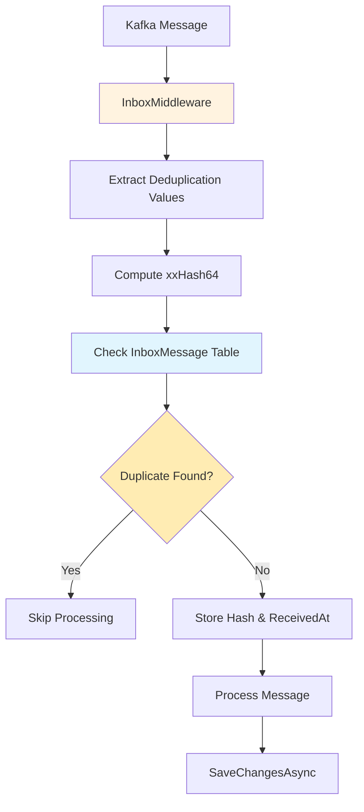

# Inbox Pattern

K-Entity-Framework implements the Inbox pattern to ensure message idempotency and prevent duplicate processing of the same message. This is critical in distributed systems where messages might be delivered more than once.

## Overview

The Inbox pattern provides:

- **Idempotency Guarantees** - Same message processed only once
- **Fast Deduplication** - Using xxHash64 algorithm for high performance
- **Configurable Time Windows** - Control how long deduplication records are kept
- **Expression-Based Configuration** - Type-safe property extraction for deduplication keys

## Architecture

### Core Components

1. **`InboxMiddleware<T>`** - Intercepts incoming messages and checks for duplicates
2. **`InboxMessage`** - Entity that stores message hashes for deduplication
3. **`xxHash64`** - High-performance hashing algorithm for duplicate detection
4. **Expression Trees** - Compile-time safe property extraction

### Message Flow



## Configuration

### Basic Inbox Setup

Configure inbox for a message type:

```csharp
modelBuilder.Topic<OrderCreated>(topic =>
{
    topic.HasName("order-events");
    
    topic.HasConsumer(consumer =>
    {
        consumer.HasInbox(inbox =>
        {
            inbox.HasDeduplicateProperties(order => order.OrderId);
        });
    });
});
```

### Composite Key Deduplication

Use multiple properties for deduplication:

```csharp
modelBuilder.Topic<PaymentProcessed>(topic =>
{
    topic.HasConsumer(consumer =>
    {
        consumer.HasInbox(inbox =>
        {
            inbox.HasDeduplicateProperties(payment => new 
            { 
                payment.OrderId, 
                payment.Amount,
                payment.PaymentMethod 
            });
        });
    });
});
```

### Time Window Configuration

Control how long deduplication records are retained:

```csharp
modelBuilder.Topic<OrderCreated>(topic =>
{
    topic.HasConsumer(consumer =>
    {
        consumer.HasInbox(inbox =>
        {
            inbox.HasDeduplicateProperties(order => order.OrderId);
            inbox.UseDeduplicationTimeWindow(TimeSpan.FromHours(24));
        });
    });
});
```

## Advanced Scenarios

### Calculated Deduplication Keys

Perform calculations within the deduplication expression:

```csharp
modelBuilder.Topic<UserActivity>(topic =>
{
    topic.HasConsumer(consumer =>
    {
        consumer.HasInbox(inbox =>
        {
            inbox.HasDeduplicateProperties(activity => new 
            { 
                activity.UserId,
                activity.ActivityType,
                DateOnly = activity.Timestamp.Date  // Only date, ignore time
            });
        });
    });
});
```

### Complex Business Logic

Use business-relevant combinations:

```csharp
modelBuilder.Topic<InventoryUpdate>(topic =>
{
    topic.HasConsumer(consumer =>
    {
        consumer.HasInbox(inbox =>
        {
            inbox.HasDeduplicateProperties(update => new 
            { 
                update.ProductId,
                update.WarehouseId,
                update.UpdateType,
                // Round to nearest hour to prevent duplicates from minor timing differences
                HourlyBucket = new DateTime(
                    update.Timestamp.Year,
                    update.Timestamp.Month, 
                    update.Timestamp.Day,
                    update.Timestamp.Hour, 0, 0)
            });
        });
    });
});
```

## Usage Examples

### Basic Consumer with Inbox

```csharp
public async Task ProcessOrderEvents(CancellationToken cancellationToken)
{
    using var scope = serviceProvider.CreateScope();
    var dbContext = scope.ServiceProvider.GetRequiredService<MyDbContext>();

    await foreach (var orderEvent in dbContext.OrderEvents.WithCancellation(cancellationToken))
    {
        // Process the message (inbox middleware ensures no duplicates)
        var order = await dbContext.Orders.FindAsync(orderEvent.OrderId);
        if (order != null)
        {
            order.Status = orderEvent.Status;
            order.UpdatedAt = DateTime.UtcNow;
        }
        
        // Commit the processing (and the inbox record)
        await dbContext.SaveChangesAsync(cancellationToken);
    }
}
```

### Batch Processing with Inbox

```csharp
public async Task ProcessBatchEvents(CancellationToken cancellationToken)
{
    using var scope = serviceProvider.CreateScope();
    var dbContext = scope.ServiceProvider.GetRequiredService<MyDbContext>();

    var batch = new List<OrderCreated>();
    
    await foreach (var orderEvent in dbContext.OrderEvents.WithCancellation(cancellationToken))
    {
        batch.Add(orderEvent);
        
        // Process in batches of 50
        if (batch.Count >= 50)
        {
            await ProcessBatch(dbContext, batch, cancellationToken);
            batch.Clear();
        }
    }
    
    // Process remaining messages
    if (batch.Count > 0)
    {
        await ProcessBatch(dbContext, batch, cancellationToken);
    }
}

private async Task ProcessBatch(MyDbContext dbContext, List<OrderCreated> events, CancellationToken cancellationToken)
{
    var orderIds = events.Select(e => e.OrderId).ToList();
    var orders = await dbContext.Orders
        .Where(o => orderIds.Contains(o.Id))
        .ToListAsync(cancellationToken);
    
    foreach (var orderEvent in events)
    {
        var order = orders.FirstOrDefault(o => o.Id == orderEvent.OrderId);
        if (order != null)
        {
            order.Status = orderEvent.Status;
            order.UpdatedAt = DateTime.UtcNow;
        }
    }
    
    await dbContext.SaveChangesAsync(cancellationToken);
}
```

## Performance Considerations

### Hash Algorithm Performance

The inbox uses xxHash64 for optimal performance:

- **Speed** - Extremely fast non-cryptographic hash
- **Quality** - Good distribution, low collision rate
- **Memory** - Minimal memory footprint

### Database Optimization

Ensure proper indexing on the InboxMessage table:

```sql
-- Index for duplicate detection queries
CREATE INDEX IX_InboxMessage_HashId 
ON InboxMessage (HashId);

-- Index for cleanup operations (manual cleanup by ReceivedAt)
CREATE INDEX IX_InboxMessage_ReceivedAt 
ON InboxMessage (ReceivedAt);
```

### Manual Cleanup Strategy

Since automatic cleanup is not built-in, implement manual cleanup of old inbox records:

```csharp
// Manual cleanup of old records
public async Task CleanupOldInboxRecords(MyDbContext dbContext, TimeSpan maxAge)
{
    var cutoffTime = DateTime.UtcNow - maxAge;
    
    var oldMessages = dbContext.Set<InboxMessage>()
        .Where(m => m.ReceivedAt <= cutoffTime);
    
    dbContext.RemoveRange(oldMessages);
    await dbContext.SaveChangesAsync();
}

// Call this periodically from a background service or scheduled job
```

## Monitoring and Observability

### Metrics to Track

- **Duplicate Message Rate** - Percentage of messages that are duplicates
- **Inbox Table Size** - Number of active deduplication records
- **Processing Latency** - Time spent on deduplication checks

### Logging

```csharp
// Inbox operations are automatically logged through standard middleware logging
// Configure logging levels to see deduplication events:
builder.Services.AddLogging(logging =>
{
    logging.SetMinimumLevel(LogLevel.Information);
    // This will log when duplicates are detected
});
```

## Best Practices

1. **Choose Meaningful Deduplication Keys** - Use business-relevant combinations
2. **Set Appropriate Time Windows** - Balance storage vs. deduplication coverage
3. **Monitor Duplicate Rates** - High rates might indicate upstream issues
4. **Implement Cleanup Strategies** - Prevent inbox table from growing indefinitely
5. **Use Composite Keys When Necessary** - Single properties might not be sufficient
6. **Consider Time Bucketing** - For time-sensitive deduplication scenarios
7. **Test Edge Cases** - Verify behavior with clock skew and retries
8. **Index Database Properly** - For optimal deduplication query performance

## Troubleshooting

### High Duplicate Rates

If you're seeing many duplicate messages:

1. **Check Producer Configuration** - Ensure proper idempotent producer settings
2. **Review Retry Logic** - Excessive retries can cause duplicates
3. **Monitor Network Issues** - Network problems can trigger duplicate sends
4. **Verify Consumer Groups** - Multiple consumers in same group can cause duplicates

### Performance Issues

If inbox operations are slow:

1. **Check Database Indexes** - Ensure proper indexing on hash columns
2. **Review Time Windows** - Very long windows create large inbox tables
3. **Monitor Cleanup** - Ensure expired records are being removed
4. **Consider Partitioning** - For very high-volume scenarios

### Missing Duplicates

If duplicates are being processed:

1. **Verify Deduplication Keys** - Ensure they uniquely identify messages
2. **Check Time Windows** - Records might be expiring too quickly
3. **Review Expression Logic** - Ensure expressions extract correct values
4. **Test Hash Collisions** - Extremely rare but possible with xxHash64
