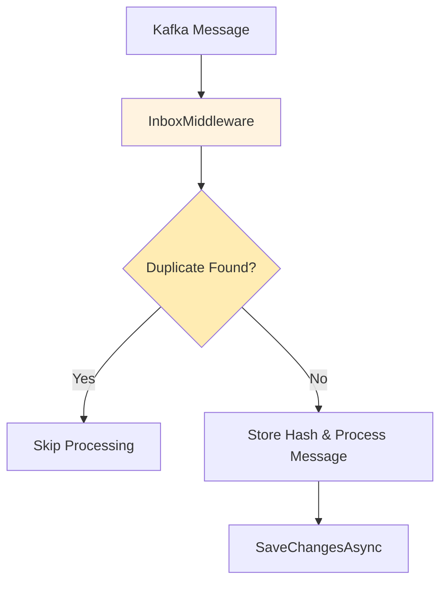

# Inbox Pattern

K-Entity-Framework implements the Inbox pattern to help ensure message idempotency and prevent duplicate processing of the same message. This is critical in distributed systems where messages might be delivered more than once.

## Overview

The Inbox pattern provides:

- **Idempotency Guarantees** - Helps ensure the same message is processed only once.
- **Fast Deduplication** - Uses a hashing algorithm for high performance.

## Architecture

### Core Components

1.  **`InboxMiddleware<T>`** - Intercepts incoming messages and checks for duplicates.
2.  **`InboxMessage`** - An entity that stores message hashes for deduplication.

### Message Flow



## Configuration

To enable the inbox, use the `HasInbox()` method on a consumer configuration in your `DbContext.OnModelCreating`.

```csharp
modelBuilder.Topic<OrderCreated>(topic =>
{
    topic.HasName("order-events");
    
    topic.HasConsumer(consumer =>
    {
        consumer.HasInbox();
    });
});
```

## Usage

When you process a message and call `SaveChangesAsync()`, the inbox middleware will automatically add a record to the `InboxMessages` table. If the same message is received again, the middleware will detect the duplicate and skip it.

```csharp
public class OrderEventProcessor : BackgroundService
{
    private readonly IServiceProvider _serviceProvider;

    public OrderEventProcessor(IServiceProvider serviceProvider)
    {
        _serviceProvider = serviceProvider;
    }

    protected override async Task ExecuteAsync(CancellationToken stoppingToken)
    {
        using var scope = _serviceProvider.CreateScope();
        var dbContext = scope.ServiceProvider.GetRequiredService<MyDbContext>();

        await foreach (var orderEvent in dbContext.OrderEvents.WithCancellation(stoppingToken))
        {
            // Process the message (the inbox middleware ensures no duplicates)
            var order = await dbContext.Orders.FindAsync(orderEvent.OrderId);
            if (order != null)
            {
                order.Status = orderEvent.Status;
            }
            
            // Commit the processing (and the inbox record)
            await dbContext.SaveChangesAsync(stoppingToken);
        }
    }
}
```

## Manual Cleanup

The inbox table will grow indefinitely if you don't clean it up. You should implement a strategy to periodically remove old records from the `InboxMessages` table. This is not a built-in feature of the library.

Here is an example of a background service that cleans up old inbox messages:

```csharp
public class InboxCleanupService : BackgroundService
{
    private readonly IServiceProvider _serviceProvider;

    public InboxCleanupService(IServiceProvider serviceProvider)
    {
        _serviceProvider = serviceProvider;
    }

    protected override async Task ExecuteAsync(CancellationToken stoppingToken)
    {
        while (!stoppingToken.IsCancellationRequested)
        {
            await Task.Delay(TimeSpan.FromHours(1), stoppingToken); // Run every hour

            using var scope = _serviceProvider.CreateScope();
            var dbContext = scope.ServiceProvider.GetRequiredService<MyDbContext>();
            
            var cutoff = DateTime.UtcNow.AddDays(-7); // Keep 7 days of records
            var oldMessages = dbContext.Set<InboxMessage>().Where(m => m.ReceivedAt < cutoff);
            
            dbContext.Set<InboxMessage>().RemoveRange(oldMessages);
            
            await dbContext.SaveChangesAsync(stoppingToken);
        }
    }
}
```