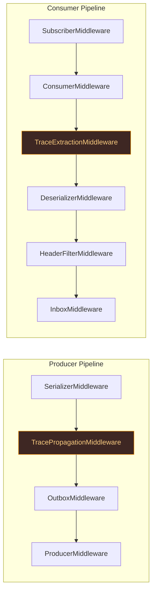

# Observability

K-Entity-Framework provides built-in OpenTelemetry instrumentation for distributed tracing and metrics, giving you end-to-end visibility into your Kafka messaging pipelines.

## Overview

Observability is enabled by default. The library emits:

- **Distributed traces** via `System.Diagnostics.ActivitySource` using W3C Trace Context propagation.
- **Metrics** via `System.Diagnostics.Metrics.Meter` with counters and histograms.

All instrumentation uses the source/meter name **`K.EntityFrameworkCore`**.

## Distributed Tracing

### Activity Names

| Activity Name | Kind | Description |
|---|---|---|
| `K.EntityFrameworkCore.Produce` | Producer | Emitted when a message is produced. Injects `traceparent`/`tracestate` headers. |
| `K.EntityFrameworkCore.Consume` | Consumer | Emitted when a message is consumed. Extracts parent context from headers. |
| `K.EntityFrameworkCore.OutboxWorker.Poll` | Internal | Spans the outbox polling cycle. Tagged with `k_ef.outbox.batch_size`. |
| `K.EntityFrameworkCore.OutboxWorker.Publish` | Internal | Spans individual outbox message publication to Kafka. |

### W3C Trace Context Propagation

Trace context is automatically propagated through Kafka message headers following the [W3C Trace Context](https://www.w3.org/TR/trace-context/) specification:

1. **Producer side** — The `TracePropagationMiddleware` injects `traceparent` and `tracestate` headers into outgoing messages.
2. **Consumer side** — The `TraceExtractionMiddleware` extracts the trace context from incoming message headers and restores the parent `Activity`, creating a continuous trace across services.

This means that a trace started in Service A will flow through Kafka and continue in Service B, appearing as a single distributed trace in tools like Jaeger, Zipkin, or Azure Monitor.

## Metrics

All metrics are published under the meter name **`K.EntityFrameworkCore`**.

| Metric Name | Type | Unit | Description |
|---|---|---|---|
| `k_ef.messages.produced` | Counter\<long\> | — | Total messages produced to Kafka. |
| `k_ef.messages.consumed` | Counter\<long\> | — | Total messages consumed from Kafka. |
| `k_ef.inbox.duplicates_filtered` | Counter\<long\> | — | Total duplicate messages filtered by the inbox pattern. |
| `k_ef.outbox.publish_duration` | Histogram\<double\> | ms | Duration of outbox publish operations. |
| `k_ef.outbox.pending` | ObservableGauge\<int\> | — | Number of pending outbox messages (when registered). |

## Configuration

### Disabling Tracing

To disable distributed tracing (trace context will not be propagated):

```csharp
services.AddDbContext<MyDbContext>(options =>
    options.UseKafkaExtensibility(client =>
    {
        client.BootstrapServers = "localhost:9092";
        client.DisableTracing();
    }));
```

### Disabling Metrics

To disable metrics collection:

```csharp
services.AddDbContext<MyDbContext>(options =>
    options.UseKafkaExtensibility(client =>
    {
        client.BootstrapServers = "localhost:9092";
        client.DisableMetrics();
    }));
```

### Subscribing in .NET

To collect traces and metrics, register the OpenTelemetry SDK in your application:

```csharp
builder.Services.AddOpenTelemetry()
    .WithTracing(tracing => tracing
        .AddSource("K.EntityFrameworkCore"))
    .WithMetrics(metrics => metrics
        .AddMeter("K.EntityFrameworkCore"));
```

## Architecture

The observability layer is implemented as middleware in the existing pipeline:



The trace middleware is positioned to run:
- **After serialization** on the producer side (so headers are already initialized).
- **After message reception** on the consumer side (so headers are available for extraction).
