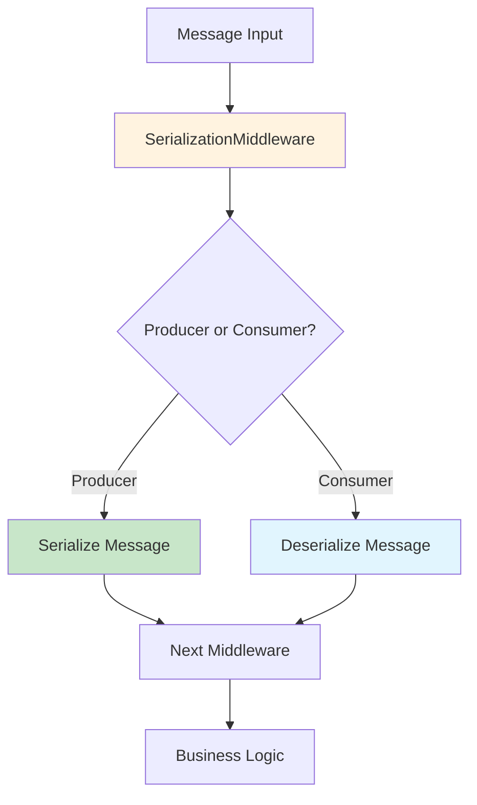

# Serialization

K-Entity-Framework provides a comprehensive and extensible serialization system that supports multiple serialization frameworks while maintaining clean separation of concerns. The system supports System.Text.Json (default), Newtonsoft.Json, MessagePack, and custom serializers through a plugin architecture.

## Overview

The enhanced serialization middleware system provides:

- **Multiple Framework Support** - JSON, MessagePack, Protobuf, and custom formats
- **Plugin Architecture** - Easy to add new serialization strategies
- **Type Safety** - Compile-time validation through generics
- **Unified API** - Consistent configuration across all serializers
- **Performance Optimized** - Minimal overhead and efficient serialization

## Supported Serializers

### System.Text.Json (Default)

The framework includes System.Text.Json as the default serializer, providing high performance and modern JSON features:

```csharp
modelBuilder.Topic<OrderCreated>(topic =>
{
    topic.UseJsonSerializer(options =>
    {
        options.PropertyNamingPolicy = JsonNamingPolicy.CamelCase;
        options.WriteIndented = false;
        options.DefaultIgnoreCondition = JsonIgnoreCondition.WhenWritingNull;
        options.PropertyNameCaseInsensitive = true;
    });
});
```

#### Advanced System.Text.Json Configuration

```csharp
modelBuilder.Topic<Order>(topic =>
{
    topic.UseJsonSerializer(options =>
    {
        // Modern JSON naming conventions
        options.PropertyNamingPolicy = JsonNamingPolicy.CamelCase;
        options.DictionaryKeyPolicy = JsonNamingPolicy.CamelCase;
        
        // Handle unknown properties gracefully
        options.UnknownTypeHandling = JsonUnknownTypeHandling.JsonNode;
        options.PropertyNameCaseInsensitive = true;
        
        // Optimize for production
        options.WriteIndented = false;
        options.DefaultIgnoreCondition = JsonIgnoreCondition.WhenWritingNull;
        
        // Custom converters
        options.Converters.Add(new JsonStringEnumConverter());
        options.Converters.Add(new CustomDateTimeConverter());
    });
});
```

### Newtonsoft.Json

For compatibility with existing systems or advanced JSON features:

```csharp
// Requires: Install-Package Newtonsoft.Json
modelBuilder.Topic<OrderCreated>(topic =>
{
    topic.UseNewtonsoftJson(settings =>
    {
        settings.NullValueHandling = NullValueHandling.Ignore;
        settings.DateFormatHandling = DateFormatHandling.IsoDateFormat;
        settings.ContractResolver = new CamelCasePropertyNamesContractResolver();
        settings.Formatting = Formatting.None;
    });
});
```

#### Advanced Newtonsoft.Json Configuration

```csharp
modelBuilder.Topic<ComplexOrder>(topic =>
{
    topic.UseNewtonsoftJson(settings =>
    {
        // Custom contract resolver
        settings.ContractResolver = new DefaultContractResolver
        {
            NamingStrategy = new CamelCaseNamingStrategy()
        };
        
        // Handle missing members
        settings.MissingMemberHandling = MissingMemberHandling.Ignore;
        settings.NullValueHandling = NullValueHandling.Ignore;
        
        // Custom date handling
        settings.DateFormatString = "yyyy-MM-dd HH:mm:ss";
        settings.DateTimeZoneHandling = DateTimeZoneHandling.Utc;
        
        // Error handling
        settings.Error = (sender, args) =>
        {
            Console.WriteLine($"JSON Error: {args.ErrorContext.Error.Message}");
            args.ErrorContext.Handled = true;
        };
        
        // Custom converters
        settings.Converters.Add(new StringEnumConverter());
        settings.Converters.Add(new CustomDecimalConverter());
    });
});
```

### MessagePack

For high-performance binary serialization:

```csharp
// Requires: Install-Package MessagePack
modelBuilder.Topic<HighVolumeEvent>(topic =>
{
    topic.UseMessagePack(options =>
    {
        options.Compression = MessagePackCompression.Lz4BlockArray;
        options.Security.HashCollisionResistant = true;
        options.Security.MaximumObjectGraphDepth = 64;
    });
});
```

#### MessagePack with Custom Resolvers

```csharp
modelBuilder.Topic<BinaryData>(topic =>
{
    topic.UseMessagePack(options =>
    {
        // Use custom resolver for better performance
        options.Resolver = MessagePack.Resolvers.CompositeResolver.Create(
            new[] { new CustomResolver() },
            new[] { MessagePack.Resolvers.StandardResolver.Instance }
        );
        
        // Enable compression for large messages
        options.Compression = MessagePackCompression.Lz4BlockArray;
        
        // Security settings
        options.Security.MaximumObjectGraphDepth = 32;
        options.Security.HashCollisionResistant = true;
    });
});
```

### Generic Serializer Usage

For dynamic serializer selection or plugin-based scenarios:

```csharp
modelBuilder.Topic<Order>(topic =>
{
    topic.UseSerializer("NewtonsoftJson", options =>
    {
        var settings = (JsonSerializerSettings)options;
        settings.DateFormatString = "yyyy-MM-dd";
        settings.NullValueHandling = NullValueHandling.Ignore;
    });
});
```

## Mixed Serialization Strategies

Different message types can use different serialization strategies within the same application:

```csharp
protected override void OnModelCreating(ModelBuilder modelBuilder)
{
    // High-performance events use MessagePack
    modelBuilder.Topic<HighVolumeEvent>(topic =>
    {
        topic.HasName("high-volume-events");
        topic.UseMessagePack(options =>
        {
            options.Compression = MessagePackCompression.Lz4BlockArray;
        });
    });

    // API events use JSON for readability and debugging
    modelBuilder.Topic<ApiEvent>(topic =>
    {
        topic.HasName("api-events");
        topic.UseJsonSerializer(options =>
        {
            options.WriteIndented = true; // Pretty print for debugging
            options.PropertyNamingPolicy = JsonNamingPolicy.CamelCase;
        });
    });

    // Legacy integration uses Newtonsoft.Json
    modelBuilder.Topic<LegacyEvent>(topic =>
    {
        topic.HasName("legacy-events");
        topic.UseNewtonsoftJson(settings =>
        {
            settings.DateFormatString = "yyyy-MM-dd HH:mm:ss";
            settings.NullValueHandling = NullValueHandling.Include;
        });
    });
}
```

## Custom Message Types

### Simple Message Types

```csharp
public class OrderCreated
{
    public string OrderId { get; set; }
    public string CustomerId { get; set; }
    public decimal Amount { get; set; }
    public DateTime CreatedAt { get; set; }
    public List<OrderItem> Items { get; set; } = new();
}

public class OrderItem
{
    public string ProductId { get; set; }
    public int Quantity { get; set; }
    public decimal Price { get; set; }
}
```

### Complex Message Types

```csharp
public class ComplexOrder
{
    public string OrderId { get; set; }
    
    [JsonPropertyName("customer")]
    public Customer Customer { get; set; }
    
    [JsonConverter(typeof(JsonStringEnumConverter))]
    public OrderStatus Status { get; set; }
    
    [JsonIgnore(Condition = JsonIgnoreCondition.WhenWritingNull)]
    public string Notes { get; set; }
    
    public Dictionary<string, object> Metadata { get; set; } = new();
}

public enum OrderStatus
{
    Pending,
    Processing,
    Shipped,
    Delivered,
    Cancelled
}
```

### MessagePack Optimized Types

```csharp
[MessagePackObject]
public class HighPerformanceEvent
{
    [Key(0)]
    public string EventId { get; set; }
    
    [Key(1)]
    public DateTime Timestamp { get; set; }
    
    [Key(2)]
    public byte[] Data { get; set; }
    
    [Key(3)]
    public Dictionary<string, string> Properties { get; set; }
}
```

## Architecture

### Core Components

The serialization system follows a strategy pattern with these key components:

1. **`SerializationMiddleware<T>`** - Unified middleware handling both serialization and deserialization
2. **`IMessageSerializer<T>`** - Strategy interface for different serialization implementations
3. **`SerializationStrategyRegistry`** - Registry for managing available serialization strategies
4. **Strategy Implementations** - Framework-specific serializers using reflection to avoid hard dependencies

### Pipeline Integration



### Key Design Principles

- **Single Middleware**: One `SerializationMiddleware<T>` handles both producer serialization and consumer deserialization
- **Strategy Pattern**: Framework-specific serializers implement `IMessageSerializer<T>` interface
- **Reflection-Based**: External dependencies accessed via reflection to avoid hard dependencies
- **Type Safety**: Generic `<T>` ensures compile-time type validation
- **Auto-Enablement**: Calling any `UseXXX()` method automatically enables the middleware

## Performance Considerations

### Serializer Performance Comparison

| Serializer | Speed | Size | Compatibility | Use Case |
|------------|-------|------|---------------|----------|
| System.Text.Json | Fast | Small | Modern | Default choice |
| MessagePack | Fastest | Smallest | Binary | High throughput |
| Newtonsoft.Json | Slow | Large | Legacy | Compatibility |

### Optimization Strategies

#### 1. Choose the Right Serializer

```csharp
// For high-throughput scenarios
topic.UseMessagePack(options =>
{
    options.Compression = MessagePackCompression.Lz4BlockArray;
});

// For development/debugging
topic.UseJsonSerializer(options =>
{
    options.WriteIndented = true; // Only in development
});

// For production JSON
topic.UseJsonSerializer(options =>
{
    options.WriteIndented = false;
    options.DefaultIgnoreCondition = JsonIgnoreCondition.WhenWritingNull;
});
```

#### 2. Optimize Message Structure

```csharp
// Efficient message design
public class OptimizedMessage
{
    public string Id { get; set; }           // Required fields first
    public DateTime Timestamp { get; set; }  // Primitive types
    public int Status { get; set; }          // Use enums as integers
    
    // Optional fields last
    public string Description { get; set; }
    public Dictionary<string, string> Metadata { get; set; }
}
```

#### 3. Serializer Caching

The framework automatically caches serializers per message type for optimal performance:

```csharp
// Serializers are cached and reused
private static readonly ConcurrentDictionary<Type, IMessageSerializer<object>> _serializerCache = new();
```

## Error Handling

### Missing Dependencies

```csharp
try
{
    topic.UseNewtonsoftJson();
}
catch (InvalidOperationException ex)
{
    // "Newtonsoft.Json is not available. Please install the Newtonsoft.Json NuGet package."
    Console.WriteLine(ex.Message);
}
```

### Serialization Errors

```csharp
public class CustomSerializationErrorHandler
{
    public void HandleSerializationError(Exception ex, Type messageType, object message)
    {
        _logger.LogError(ex, "Failed to serialize {MessageType}: {Message}", 
            messageType.Name, message);
            
        // Custom error handling logic
        if (ex is JsonException jsonEx)
        {
            // Handle JSON-specific errors
        }
        else if (ex is MessagePackSerializationException mpEx)
        {
            // Handle MessagePack-specific errors
        }
    }
}
```

### Graceful Degradation

```csharp
public class FallbackSerializationStrategy
{
    public byte[] SerializeWithFallback<T>(T message) where T : class
    {
        try
        {
            // Try primary serializer
            return _primarySerializer.Serialize(message);
        }
        catch (Exception ex)
        {
            _logger.LogWarning(ex, "Primary serialization failed, using fallback");
            
            // Use fallback serializer
            return _fallbackSerializer.Serialize(message);
        }
    }
}
```

## Testing Strategies

### Unit Testing Serialization

```csharp
[Test]
public void JsonSerializer_SerializesCorrectly()
{
    // Arrange
    var message = new OrderCreated
    {
        OrderId = "123",
        CustomerId = "customer-456",
        Amount = 99.99m,
        CreatedAt = DateTime.UtcNow
    };
    
    var options = new JsonSerializerOptions
    {
        PropertyNamingPolicy = JsonNamingPolicy.CamelCase
    };
    
    var serializer = new SystemTextJsonSerializer<OrderCreated>(options);
    
    // Act
    var serialized = serializer.Serialize(message);
    var deserialized = serializer.Deserialize(serialized);
    
    // Assert
    Assert.Equal(message.OrderId, deserialized.OrderId);
    Assert.Equal(message.CustomerId, deserialized.CustomerId);
    Assert.Equal(message.Amount, deserialized.Amount);
}
```

### Integration Testing

```csharp
[Test]
public async Task MessageRoundTrip_WithJsonSerialization_PreservesData()
{
    // Arrange
    var options = new DbContextOptionsBuilder<TestDbContext>()
        .UseInMemoryDatabase(databaseName: Guid.NewGuid().ToString())
        .UseKafkaExtensibility(client =>
        {
            client.BootstrapServers = "localhost:9092";
        })
        .Options;

    using var dbContext = new TestDbContext(options);
    
    var testMessage = new TestMessage { Id = "123", Content = "Test" };
    
    // Act
    dbContext.TestTopic.Publish(testMessage);
    await dbContext.SaveChangesAsync();
    
    // For consumer testing, you would typically use integration tests
    // with actual Kafka infrastructure or test containers
    
    // Assert
    Assert.Equal("123", testMessage.Id);
    Assert.Equal(testMessage.Content, result.Message.Content);
}
```

## Migration Guide

### From Legacy Serialization

#### Before (Legacy)
```csharp
topic.UseJsonSerializer(options =>
{
    options.PropertyNamingPolicy = JsonNamingPolicy.CamelCase;
});
// Uses SerializationOptions<T>.Options (JsonSerializerOptions)
```

#### After (Enhanced)
```csharp
topic.UseJsonSerializer(options =>
{
    options.PropertyNamingPolicy = JsonNamingPolicy.CamelCase;
});
// Uses SerializationOptions<T>.SystemTextJsonOptions (JsonSerializerOptions)
```

### Breaking Changes

- `SerializationOptions<T>.Options` → `SerializationOptions<T>.SystemTextJsonOptions`
- `DeserializerMiddleware<T>` is obsolete, use `SerializationMiddleware<T>`
- Custom serializers must implement `IMessageSerializer<T>` interface

## Best Practices

### 1. Choose Appropriate Serializers

- **System.Text.Json**: Default choice for most scenarios
- **MessagePack**: High-throughput, binary data, microservices
- **Newtonsoft.Json**: Legacy compatibility, complex JSON scenarios

### 2. Message Design

- Keep messages simple and focused
- Use primitive types when possible
- Avoid deep object hierarchies
- Consider forward/backward compatibility

### 3. Performance Optimization

- Disable indentation in production
- Use appropriate compression for MessagePack
- Cache serializers when possible
- Monitor serialization performance

### 4. Error Handling

- Implement proper error handling for serialization failures
- Use logging to track serialization issues
- Consider fallback strategies for critical scenarios

## Next Steps

- [Plugin Architecture](../architecture/plugin-serialization.md) - Learn about creating custom serializers
- [Performance Tuning](../guides/performance-tuning.md) - Optimize serialization performance
- [Examples](../examples/serialization-examples.md) - See more serialization examples
