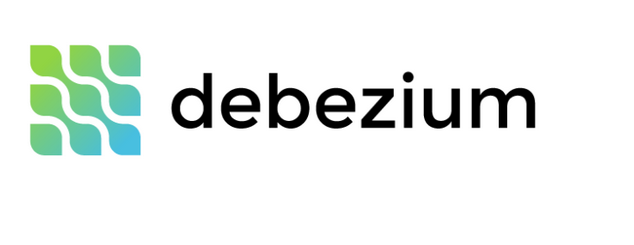
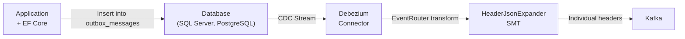

# Debezium Integration Overview



Use Debezium with K-Entity-Framework's outbox pattern for low-latency, real-time event streaming from your database.

## What is Debezium?

Debezium is an open-source distributed platform for change data capture (CDC). It captures row-level changes in your database and streams them to Kafka topics in real-time. When integrated with K-Entity-Framework's outbox pattern, Debezium provides:

- **Millisecond latency** - Changes are captured directly from transaction logs
- **Guaranteed delivery** - No messages are lost, even during failures
- **Exactly-once semantics** - Messages are published exactly once per database transaction
- **Zero application overhead** - No polling workers needed

## How It Works

1. **Application writes** to the outbox table within a transaction
2. **Debezium captures** the database change from the transaction log
3. **EventRouter SMT** transforms the outbox record into a proper Kafka message
4. **HeaderJsonExpander SMT** promotes individual Kafka headers from the headers blob
5. **Message is published** to the configured Kafka topic automatically

## Architecture



## When to Use Debezium

> [!TIP]
> **Use Debezium when:**
> - You need **sub-second latency** for event publishing
> - You have **high-throughput** requirements (thousands of events/second)
> - You're building **event-driven architectures** requiring real-time processing
> - You want to **eliminate polling overhead** from your application
> - You need **operational visibility** into database changes

> [!WARNING]
> **Use Polling Worker when:**
> - You have a **simple setup** with low event volume
> - **Ease of deployment** is more important than latency
> - You don't want to manage CDC infrastructure
> - Events can be delayed by seconds without impact

For polling worker setup, see the [OutboxPollingWorker documentation](../features/outbox.md).

## Custom SMT Requirement

The integration requires a **custom Kafka Connect SMT** (`HeaderJsonExpander`) that ships with this project. Use the pre-built Docker Hub image:

```
clebermargarida/kafka-connect-smt:latest
```

> If you skip the custom image and use the stock `quay.io/debezium/connect`, see [Limitation: Custom Headers Without the SMT](#limitation-custom-headers-without-the-smt).

### Topic Routing Behavior

The outbox table includes a required `Topic` column that stores the topic name for each message:

- **Default behavior**: If no custom topic name is configured, the `Topic` field contains the message type's full name
- **Custom topic names**: When using `topic.HasName("custom-name")`, the `Topic` field contains `"custom-name"`
- **Always populated**: The `Topic` field is never null, ensuring consistent routing
- **Debezium routing**: The EventRouter uses the `Topic` field to determine the correct Kafka topic

### Transform Chain

The connector config uses two chained transforms:

1. **EventRouter** maps the `Headers` JSONB column to a single blob Kafka header (`__debezium.outbox.headers`).
2. **HeaderJsonExpander** reads that blob, promotes every JSON field to its own individual Kafka header, and removes the blob header.

The resulting Kafka message carries individual headers — `$type`, `$runtimeType`, and any user-defined custom headers — identical to messages produced by the polling worker.

```json
"transforms": "outbox,expandHeaders",
"transforms.outbox.table.fields.additional.placement": "Headers:header:__debezium.outbox.headers",
"transforms.expandHeaders.type": "k.entityframework.kafka.connect.transforms.HeaderJsonExpander"
```

Only `transforms.expandHeaders.type` is mandatory — `source.header.name` and `remove.source.header` default to the correct values.

---

## Limitation: Custom Headers Without the SMT

If you use the **stock `quay.io/debezium/connect` image** (without `HeaderJsonExpander`), the EventRouter can only map the entire `Headers` JSONB column to a single blob header. It cannot split JSON fields into individual Kafka headers.

### What breaks

The consumer framework reads Kafka headers individually — including `$type` for type routing. Without the SMT:

| Header | With SMT | Without SMT |
|---|---|---|
| `$type` | ✅ Individual Kafka header | ❌ Buried inside JSON blob |
| `$runtimeType` | ✅ Individual Kafka header | ❌ Buried inside JSON blob |
| Custom user headers | ✅ Individual Kafka headers | ❌ Buried inside JSON blob |

**Concrete failure:** The consumer throws at dispatch time:

```
InvalidOperationException: The required '$type' Kafka header was not found on the message.
```

### Why the polling worker is unaffected

The built-in polling worker calls `ProducerMiddlewareSettings.GetHeaders()`, which writes `$type`, `$runtimeType`, and all user-defined headers as individual Confluent Kafka headers from the start. There is no blob step, so no SMT is needed.

---

## HeaderJsonExpander SMT Reference

`HeaderJsonExpander` is a Kafka Connect Single Message Transform that expands a JSON-encoded Kafka header blob into individual headers.

**Source:** `src/kafka-connect-smt/`

| Property | Default | Description |
|---|---|---|
| `source.header.name` | `__debezium.outbox.headers` | The Kafka header whose value is JSON to expand |
| `remove.source.header` | `true` | Remove the source blob header after expansion |

---

## Building the Custom Image Manually

Build the custom Kafka Connect image locally if you prefer not to pull from Docker Hub or want to modify the SMT.

**Prerequisites:** Docker Desktop or Docker Engine.

### Option A — Docker multi-stage build (recommended)

No local JDK required; Maven runs inside the build container.

```bash
# From the repository root
docker build \
  -t my-org/kafka-connect-smt:latest \
  src/kafka-connect-smt
```

### Option B — Local Maven, then Docker

```bash
cd src/kafka-connect-smt

# 1. Build the fat JAR (requires JDK 17 + Maven 3.9+)
mvn package -DskipTests

# 2. Build the Docker image
docker build -t my-org/kafka-connect-smt:latest .
```

### Verify the image

```bash
docker run --rm my-org/kafka-connect-smt:latest \
  ls /kafka/connect/header-json-expander/
# Expected: header-json-expander-1.0.0.jar
```

### Docker Hub

A pre-built image is published at `clebermargarida/kafka-connect-smt:latest`.

```bash
docker pull clebermargarida/kafka-connect-smt
```

New versions are published via the **Publish SMT Docker Image** GitHub Actions workflow.

---

## Migration Guidance

If you are upgrading from a version that did not use the `HeaderJsonExpander` SMT:

1. **Build or pull the custom image** — follow [Building the Custom Image Manually](#building-the-custom-image-manually) or `docker pull clebermargarida/kafka-connect-smt`.
2. **Update `docker-compose.yml` / Aspire AppHost** — replace `quay.io/debezium/connect` with the custom image.
3. **Reconfigure the Debezium connector** — add `expandHeaders` to `transforms` and set `transforms.expandHeaders.type` as shown in [Transform Chain](#transform-chain).
4. **Restart the connector** — delete and recreate it, or `PUT /connectors/{name}/config`.

> **Note:** Drain in-flight messages before reconfiguring the connector. There is no backwards-compatible rolling-upgrade path.

---

## Next Steps

- [SQL Server Setup](debezium-sqlserver.md) - Configure CDC for SQL Server
- [PostgreSQL Setup](debezium-postgresql.md) - Configure CDC for PostgreSQL
- [Complete Example](debezium-example.md) - Full working implementation with SQL Server
- [Aspire Integration](debezium-aspire.md) - Deploy with .NET Aspire and PostgreSQL

## Resources

- [Debezium Documentation](https://debezium.io/documentation/)
- [Outbox Event Router](https://debezium.io/documentation/reference/transformations/outbox-event-router.html)
- [K-Entity-Framework Outbox Pattern](../features/outbox.md)
- [Docker Hub: clebermargarida/kafka-connect-smt](https://hub.docker.com/repository/docker/clebermargarida)
