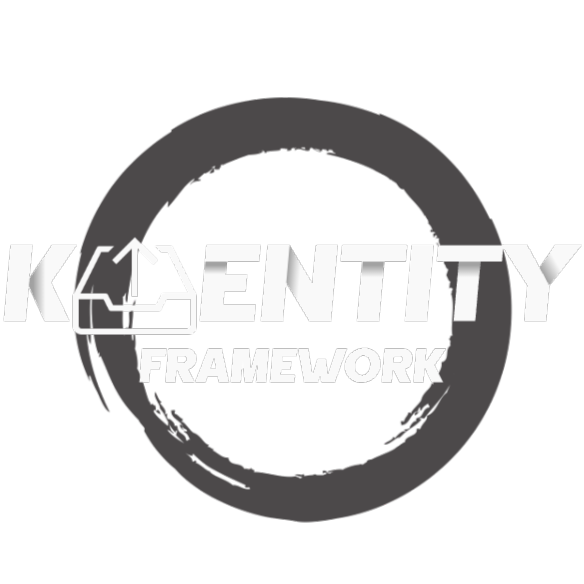

<div align="center">
  
</div>
<div align="center" style="margin: 2rem 0;">

[](https://github.com/cleberMargarida/k-entity-framework/actions/workflows/dotnet.yml)
[](https://www.nuget.org/packages/K.EntityFrameworkCore/)
[](https://www.nuget.org/packages/K.EntityFrameworkCore/)
[](https://opensource.org/licenses/MIT)
[](https://cleberMargarida.github.io/k-entity-framework/)
[](https://github.com/cleberMargarida/k-entity-framework/releases/latest)

</div>

#### **Kafka that actually feels like Entity Framework**
Use Kafka with the same patterns you already know. No complexity, no surprises.

<style>
.ide-comparison {
    display: grid;
    grid-template-columns: 1fr 1fr;
    gap: 2rem;
    margin: 3rem 0;
}

.ide-comparison h3 {
    margin: 0 0 1rem 0;
    text-align: center;
    font-size: 1.2rem;
}

.problem-title {
    color: #f85149;
}

.solution-title {
    color: #3fb950;
}

/* Transform the next code block into an IDE window */
.ide-comparison pre {
    position: relative;
    background: #1e1e1e !important;
    border: 1px solid #333 !important;
    border-radius: 8px !important;
    overflow: hidden !important;
    box-shadow: 0 8px 25px rgba(0, 0, 0, 0.3) !important;
    transition: transform 0.3s ease, box-shadow 0.3s ease;
    margin: 0 !important;
}

.ide-comparison pre:hover {
    transform: translateY(-3px);
    box-shadow: 0 12px 35px rgba(0, 0, 0, 0.4) !important;
}

/* Add window controls */
.ide-comparison pre::before {
    content: "";
    position: absolute;
    top: 0;
    left: 0;
    right: 0;
    height: 40px;
    background: #2d2d30;
    border-bottom: 1px solid #3e3e42;
    z-index: 1;
}

/* Add window control buttons */
.ide-comparison pre::after {
    content: "";
    position: absolute;
    top: 14px;
    left: 16px;
    width: 12px;
    height: 12px;
    background: #ff5f56;
    border-radius: 50%;
    box-shadow: 20px 0 0 #ffbd2e, 40px 0 0 #27ca3f;
    z-index: 2;
}

/* Adjust code content to account for header */
.ide-comparison code {
    display: block;
    padding-top: 60px !important;
    padding-left: 1.5rem !important;
    padding-right: 1.5rem !important;
    padding-bottom: 1.5rem !important;
    background: transparent !important;
    font-family: 'Consolas', 'Monaco', 'Lucida Console', monospace !important;
}

/* Problem window styling */
.ide-comparison .problem-side pre {
    border-left: 4px solid #f85149 !important;
}

/* Solution window styling */
.ide-comparison .solution-side pre {
    border-left: 4px solid #3fb950 !important;
}

/* Make it responsive */
@media (max-width: 768px) {
    .ide-comparison {
        grid-template-columns: 1fr;
        gap: 1rem;
    }
}

.section-title {
    text-align: center;
    font-size: 2.5rem;
    font-weight: 700;
    background: linear-gradient(135deg, #f97316 0%, #ef4444 50%, #dc2626 100%);
    -webkit-background-clip: text;
    -webkit-text-fill-color: transparent;
    background-clip: text;
    margin: 3rem 0 2rem 0;
}
</style>

<div class="ide-comparison">
<div class="problem-side">

### What you're doing now 😤

```csharp
// Multiple configuration files, scattered setup
var config = new ProducerConfig
{
    BootstrapServers = "localhost:9092",
    ClientId = "my-app",
    // ... 20+ more properties
};

var producer = new ProducerBuilder<string, string>(config).Build();

// Manual transaction management
dbContext.Orders.Add(order);
await dbContext.SaveChangesAsync();
    
// Separate Kafka operation - consistency risk!
await producer.ProduceAsync("order-events", message);
```

</div>
<div class="solution-side">

### With K.EntityFrameworkCore ✨

```csharp
dbContext.Orders.Add(new Order { Id = 123 });
dbContext.OrderEvents.Produce(new OrderCreated { OrderId = 123 });

await dbContext.SaveChangesAsync(); // 🎉 Both computed!
```

</div>
</div>

#### **🏗️ Topic&lt;T&gt; works like DbSet&lt;T&gt;**
Configure Kafka topics the same way you configure entities. Your team already knows how to use this.

> [!NOTE]
> No new concepts to learn. If you can write `modelBuilder.Entity<Order>()`, you can write `modelBuilder.Topic<OrderEvent>()`.

</div>

</div>

---

#### **Quick Start: From Zero to Kafka in 3 Steps**

**1️⃣ Define Your DbContext**
```csharp
public class OrderContext(DbContextOptions options) : DbContext(options)
{
    // Your regular entities
    public DbSet<Order> Orders { get; set; }
    
    // Kafka topics - just like DbSets!
    public Topic<OrderEvent> OrderEvents { get; set; }
    
    protected override void OnModelCreating(ModelBuilder modelBuilder)
    {
        // Configure your topic like you would any entity
        modelBuilder.Topic<OrderEvent>(topic =>
        {
            topic.HasName("order-events");
            topic.HasProducer(p => p.HasOutbox()); // Built-in outbox!
            topic.HasConsumer(c => c.HasInbox());  // Built-in deduplication!
        });
    }
}
```

**2️⃣ Configure Services**
```csharp
builder.Services.AddDbContext<OrderContext>(options => options
    .UseSqlServer("your-connection-string")
    .UseKafkaExtensibility("localhost:9092"));
```

**3️⃣ Produce & Consume**
```csharp
// Producing is just like adding entities
dbContext.Orders.Add(new Order { Id = 123 });
dbContext.OrderEvents.Produce(new OrderCreated { OrderId = 123 });
await dbContext.SaveChangesAsync(); // Both saved atomically! 🎉

// Consuming feels natural too
await foreach (var orderEvent in dbContext.OrderEvents)
{
    // Process your message
    await ProcessOrder(orderEvent.Value);
    
    // Commit to mark as processed
    await dbContext.SaveChangesAsync();
}
```

---

<style>
.cta-section {
    position: relative;
    margin: 4rem 0;
    padding: 3rem 2rem;
    background: linear-gradient(135deg, #1a1a1a 0%, #2d2d2d 30%, #1f1f23 70%, #252530 100%);
    border-radius: 20px;
    box-shadow: 0 20px 60px rgba(0, 0, 0, 0.6);
    text-align: center;
    color: #e5e7eb;
    overflow: hidden;
    animation: gentle-float 6s ease-in-out infinite;
    border: 1px solid #374151;
}

/* Animated background elements */
.cta-section::before {
    content: "";
    position: absolute;
    top: -50%;
    left: -50%;
    width: 200%;
    height: 200%;
    background: radial-gradient(circle, rgba(75,85,99,0.1) 1px, transparent 1px);
    background-size: 50px 50px;
    animation: drift 20s linear infinite;
    z-index: 0;
}

.cta-section::after {
    content: "";
    position: absolute;
    top: 0;
    left: 0;
    right: 0;
    bottom: 0;
    background: linear-gradient(45deg, transparent 30%, rgba(156,163,175,0.05) 50%, transparent 70%);
    animation: shimmer 3s ease-in-out infinite;
    z-index: 0;
}

.cta-content {
    position: relative;
    z-index: 1;
}

.cta-title {
    font-size: 3rem;
    font-weight: 800;
    margin-bottom: 1rem;
    text-shadow: 0 2px 10px rgba(0,0,0,0.5);
    background: linear-gradient(135deg, #f9fafb 0%, #d1d5db 100%);
    -webkit-background-clip: text;
    -webkit-text-fill-color: transparent;
    background-clip: text;
}

.cta-subtitle {
    font-size: 1.3rem;
    margin-bottom: 1rem;
    opacity: 0.95;
    font-weight: 600;
}

.cta-description {
    font-size: 1.1rem;
    margin-bottom: 2rem;
    opacity: 0.9;
    max-width: 600px;
    margin-left: auto;
    margin-right: auto;
    line-height: 1.6;
}

.install-section {
    background: rgba(17,24,39,0.5);
    border-radius: 12px;
    padding: 1.5rem;
    margin: 2rem 0;
    backdrop-filter: blur(10px);
    border: 1px solid rgba(75,85,99,0.3);
}

.install-title {
    font-size: 1.2rem;
    margin-bottom: 1rem;
    font-weight: 600;
}

.install-command {
    background: #0f172a;
    color: #10b981;
    padding: 1rem 1.5rem;
    border-radius: 8px;
    font-family: 'Consolas', 'Monaco', 'Lucida Console', monospace;
    font-size: 1rem;
    border: 1px solid #1f2937;
    display: inline-block;
    position: relative;
    box-shadow: 0 4px 15px rgba(0,0,0,0.4);
    animation: code-glow 2s ease-in-out infinite alternate;
}

.button-grid {
    display: grid;
    grid-template-columns: repeat(auto-fit, minmax(200px, 1fr));
    gap: 1rem;
    margin: 2rem 0;
    max-width: 800px;
    margin-left: auto;
    margin-right: auto;
}

.cta-button {
    display: flex;
    align-items: center;
    justify-content: center;
    gap: 0.5rem;
    padding: 1rem 1.5rem;
    text-decoration: none;
    border-radius: 12px;
    font-weight: 600;
    font-size: 0.95rem;
    transition: all 0.3s ease;
    position: relative;
    overflow: hidden;
    box-shadow: 0 4px 15px rgba(0,0,0,0.2);
}

.cta-button::before {
    content: "";
    position: absolute;
    top: 0;
    left: -100%;
    width: 100%;
    height: 100%;
    background: linear-gradient(90deg, transparent, rgba(156,163,175,0.2), transparent);
    transition: left 0.5s ease;
}

.cta-button:hover::before {
    left: 100%;
}

.cta-button:hover {
    transform: translateY(-2px);
    box-shadow: 0 8px 25px rgba(0,0,0,0.3);
}

.btn-primary {
    background: #374151;
    color: #f9fafb;
    border: 1px solid #4b5563;
}

.btn-success {
    background: #065f46;
    color: #d1fae5;
    border: 1px solid #047857;
}

.btn-outline {
    background: transparent;
    color: #e5e7eb;
    border: 2px solid #6b7280;
}

.btn-dark {
    background: #111827;
    color: #f3f4f6;
    border: 1px solid #1f2937;
}

.community-section {
    margin-top: 2rem;
    padding-top: 2rem;
    border-top: 1px solid rgba(75,85,99,0.3);
}

.community-title {
    font-size: 1.3rem;
    margin-bottom: 1.5rem;
    font-weight: 600;
}

.community-links {
    display: flex;
    flex-wrap: wrap;
    justify-content: center;
    gap: 2rem;
    font-size: 1rem;
}

.community-links a {
    color: #d1d5db;
    text-decoration: none;
    opacity: 0.9;
    transition: all 0.3s ease;
    display: flex;
    align-items: center;
    gap: 0.5rem;
}

.community-links a:hover {
    opacity: 1;
    transform: translateY(-1px);
    text-shadow: 0 2px 8px rgba(156,163,175,0.3);
    color: #f3f4f6;
}

/* Animations */
@keyframes gentle-float {
    0%, 100% { transform: translateY(0px); }
    50% { transform: translateY(-5px); }
}

@keyframes drift {
    0% { transform: translate(0, 0) rotate(0deg); }
    100% { transform: translate(-50px, -50px) rotate(360deg); }
}

@keyframes shimmer {
    0%, 100% { opacity: 0; }
    50% { opacity: 1; }
}

@keyframes code-glow {
    0% { box-shadow: 0 4px 15px rgba(0,255,136,0.2); }
    100% { box-shadow: 0 4px 25px rgba(0,255,136,0.4); }
}

/* Responsive */
@media (max-width: 768px) {
    .cta-section {
        margin: 2rem 1rem;
        padding: 2rem 1rem;
    }
    
    .cta-title {
        font-size: 2rem;
    }
    
    .button-grid {
        grid-template-columns: 1fr;
        gap: 0.8rem;
    }
    
    .community-links {
        flex-direction: column;
        gap: 1rem;
    }
}
</style>

<div class="cta-section">
    <div class="cta-content">
        <h2 class="cta-title">Ready to stop fighting Kafka?</h2>
        
        <div class="cta-subtitle">Get Started in Under 5 Minutes</div>
        
        <p class="cta-description">
            Install it now and start using Kafka the way it should have worked from the beginning.
        </p>
        
        <div class="install-section">
            <div class="install-title">Installation</div>
            <div class="install-command">dotnet add package K.EntityFrameworkCore</div>
        </div>
        
        <div class="button-grid">
            <a href="getting-started/" class="cta-button btn-primary">
                <span>📖</span>
                <strong>Quick Start Guide</strong>
            </a>
            
            <a href="/features/outbox.html" class="cta-button btn-success">
                <span>🛡️</span>
                <strong>See Outbox Pattern</strong>
            </a>
            
            <a href="https://www.nuget.org/packages/K.EntityFrameworkCore/" class="cta-button btn-outline">
                <span>📦</span>
                <strong>Install from NuGet</strong>
            </a>
            
            <a href="https://github.com/cleberMargarida/k-entity-framework" class="cta-button btn-dark">
                <span>⭐</span>
                <strong>Star on GitHub</strong>
            </a>
        </div>
        
        <div class="community-section">
            <div class="community-title">Join the Community</div>
            <div class="community-links">
                <a href="https://github.com/cleberMargarida/k-entity-framework/issues">
                    <span>🐛</span>
                    <strong>Found a bug? Open an issue</strong>
                </a>
                <a href="https://github.com/cleberMargarida/k-entity-framework/discussions">
                    <span>💡</span>
                    <strong>Have a feature idea? Start a discussion</strong>
                </a>
                <a href="https://github.com/cleberMargarida/k-entity-framework/blob/master/CONTRIBUTING.md">
                    <span>🤝</span>
                    <strong>Want to contribute? Check our guide</strong>
                </a>
            </div>
        </div>
    </div>
</div>

---
